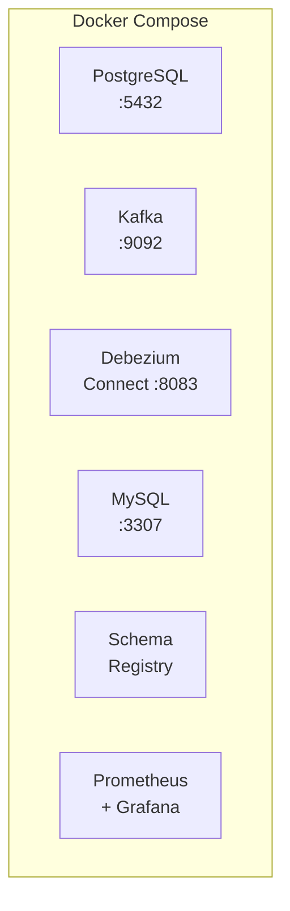

# Лабораторная среда

Курс включает практические задания в локальном Docker-окружении. Вот что нужно подготовить.

---

## Требования

Для выполнения практических заданий вам понадобится:

| Требование | Минимум | Рекомендуется |
|------------|---------|---------------|
| **Docker Desktop** | v4.0+ | Последняя версия |
| **RAM** | 8 GB | 16 GB |
| **Диск** | 10 GB свободно | 20 GB |
| **ОС** | macOS / Linux / Windows | macOS M-series (ARM64) |

**Docker Compose** включён в Docker Desktop.

---

## Что входит в лабораторию

В Module 1 вы развернёте полную CDC-инфраструктуру:



<KnowledgeCheck
  question={'Какой инструмент используется для лабораторной среды курса и каковы минимальные требования к оперативной памяти?'}
  answer={'Лабораторная среда основана на Docker Desktop (v4.0+) с Docker Compose. Минимальное требование к RAM — 8 ГБ, рекомендуется 16 ГБ. Docker Compose поднимает полную CDC-инфраструктуру: PostgreSQL, MySQL, Kafka, Debezium Connect, Schema Registry, Prometheus и Grafana.'}
/>

---

## Проверка готовности

Выполните эти команды, чтобы убедиться, что всё готово:

```bash
# Проверка Docker
docker --version
# Docker version 24.0.0 или выше

# Проверка Docker Compose
docker compose version
# Docker Compose version v2.20.0 или выше

# Проверка свободной памяти
docker info | grep "Total Memory"
# Total Memory: 7.748GiB или больше
```

---

## Когда начинать практику

**Модуль 0** — только теория и ориентация в курсе.

**Модуль 1** — с урока "Lab Setup" начинается практика:
- Клонирование репозитория курса
- `docker compose up` для запуска инфраструктуры
- Первый CDC-коннектор

Пока можно продолжить изучение теории без Docker.
