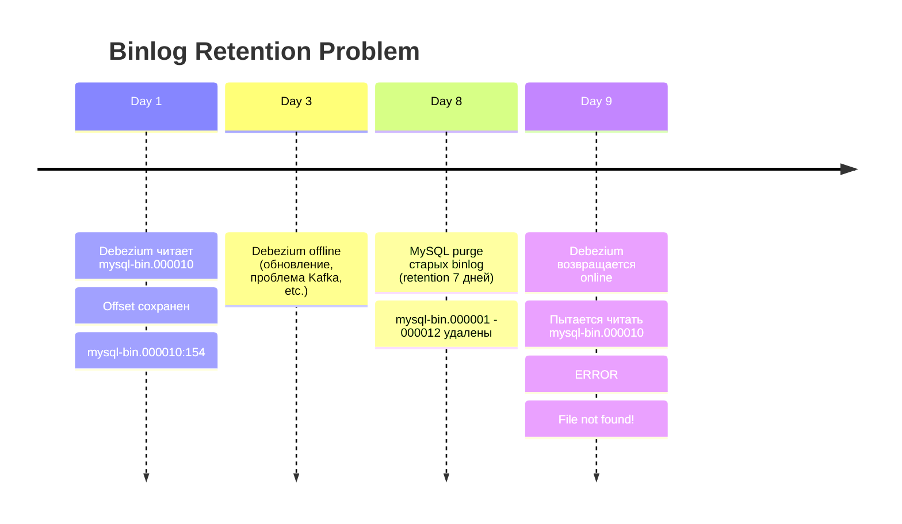
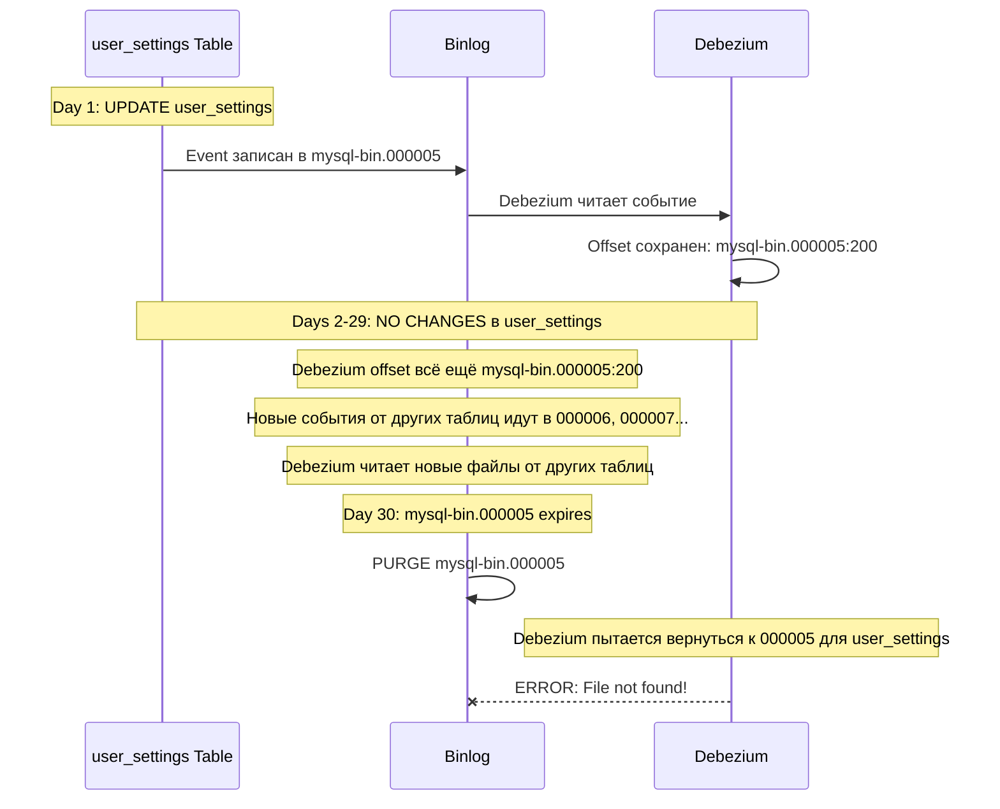
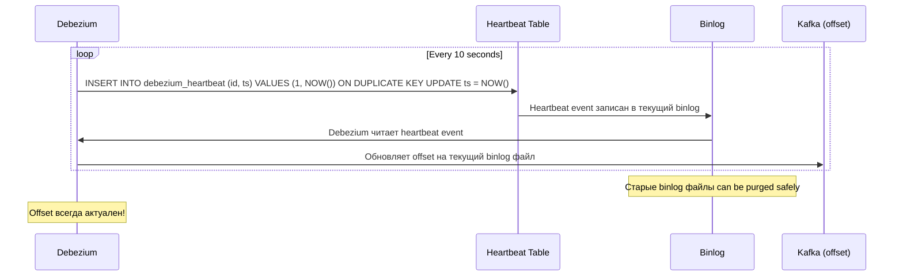

import { Mermaid } from '../../../components/Mermaid.tsx';
import Callout from '../../../components/Callout.tsx';

# Binlog Retention и Heartbeat: Защита от потери позиции

## The Retention Problem: Катастрофа purge

В предыдущих уроках мы изучили, что MySQL binlog - это последовательность файлов (mysql-bin.000001, mysql-bin.000002, ...), которые содержат историю всех изменений данных. Debezium читает эти файлы и отслеживает свою позицию.

Но binlog файлы не хранятся вечно. Они занимают дисковое пространство, и MySQL автоматически **удаляет (purge) старые файлы** через определенный период времени.

### Сценарий катастрофы

<Mermaid>

</Mermaid>

**Ошибка**:
```
Cannot replicate because the master purged required binary logs.
Replicate the missing transactions from elsewhere, or provision a new slave from backup.
Consider increasing the master's binary log expiration period.
```

**Последствия**:
- Debezium не может продолжить чтение
- Требуется **полный resnapshot** всей базы данных
- Resnapshot может занять **часы или дни** для больших таблиц (сотни GB)
- Downtime CDC pipeline
- Потенциальная потеря событий за период offline

**Профилактика** - это тема данного урока.

## Binlog Retention: Конфигурация

### Параметр binlog_expire_logs_seconds

Это главный параметр, контролирующий, как долго MySQL хранит binlog файлы.

**Проверка текущего значения**:

```sql
SHOW VARIABLES LIKE 'binlog_expire_logs_seconds';
```

**Результат (default в MySQL 8.0)**:
```
+----------------------------+----------+
| Variable_name              | Value    |
+----------------------------+----------+
| binlog_expire_logs_seconds | 2592000  |
+----------------------------+----------+
```

`2592000` секунд = **30 дней** (default retention).

**В нашем docker-compose.yml** мы настроили 7 дней:

```yaml
mysql:
  command:
    - "--binlog-expire-logs-seconds=604800"  # 7 days
```

`604800` секунд = 7 дней.

### Как MySQL purge работает?

MySQL проверяет возраст binlog файлов при:

1. **Ротации binlog** (создание нового файла mysql-bin.NNNNNN)
2. **Явном вызове** `FLUSH BINARY LOGS`
3. **Перезапуске сервера**

Если файл старше `binlog_expire_logs_seconds`, он удаляется.

**Важно**: MySQL удаляет **целые файлы**, а не отдельные события. Даже если в файле есть недавние события, но файл был создан давно - он будет purged.

### Retention Planning: Формула

Как выбрать правильное значение для `binlog_expire_logs_seconds`?

**Формула**:
```
Retention = Max Expected Debezium Downtime + Safety Margin
```

**Примеры**:

| Scenario                              | Max Downtime | Safety Margin | Retention         |
|---------------------------------------|--------------|---------------|-------------------|
| Stable production (редкие сбои)       | 2 дня        | 2x            | 4 дня (345600s)   |
| Frequent deployments                  | 1 день       | 3x            | 3 дня (259200s)   |
| Dev/test environment                  | 1 неделя     | 1x            | 1 неделя (604800s)|
| Critical production (zero tolerance)  | 3 дня        | 5x            | 15 дней (1296000s)|

**Trade-off**: Disk Space vs Recovery Safety

- **Больше retention** = больше disk space, но меньше риск position loss
- **Меньше retention** = меньше disk space, но выше риск position loss

### Мониторинг binlog disk usage

Проверить, сколько места занимают binlog файлы:

```sql
SHOW BINARY LOGS;
```

**Результат**:
```
+------------------+-----------+-----------+
| Log_name         | File_size | Encrypted |
+------------------+-----------+-----------+
| mysql-bin.000001 | 179       | No        |
| mysql-bin.000002 | 179       | No        |
| mysql-bin.000003 | 1548      | No        |
| mysql-bin.000004 | 891       | No        |
| mysql-bin.000005 | 156       | No        |
+------------------+-----------+-----------+
```

Суммарный размер можно посчитать через bash:

```bash
docker compose exec mysql mysql -u root -pmysql -e "SHOW BINARY LOGS" | awk '{sum+=$2} END {print "Total binlog size: " sum " bytes"}'
```

Для production систем с высокой нагрузкой:
- **Binlog может расти на десятки GB в день**
- Retention 30 дней может означать **сотни GB** на диске
- Необходимо мониторить и планировать disk capacity

## Deprecated: expire_logs_days

В старых версиях MySQL (5.x, ранние 8.x) использовался параметр `expire_logs_days`.

**Формат**: Целое число дней (не секунды).

**Пример**:
```sql
SET GLOBAL expire_logs_days = 7;
```

**Статус в MySQL 8.0**:
- **Deprecated** (устарел)
- Заменен на `binlog_expire_logs_seconds` для более точной настройки
- Если оба параметра установлены, **приоритет имеет binlog_expire_logs_seconds**

**Почему вы можете встретить expire_logs_days**:
- Старые туториалы и документация
- Legacy configurations
- Миграция с MySQL 5.x

**Рекомендация**: Используйте `binlog_expire_logs_seconds` для новых проектов.

## Manual Purge: Опасная операция

MySQL позволяет **вручную удалить** binlog файлы.

<Callout type="danger" title="Danger Zone: Ручной purge может сломать CDC">

**Команда**:
```sql
PURGE BINARY LOGS TO 'mysql-bin.000010';
```

Это **немедленно удаляет** все binlog файлы до mysql-bin.000010 (не включая 000010).

**Когда использовать**:
- Emergency disk space recovery
- Вы **абсолютно уверены**, что Debezium и все replica прочитали эти файлы

**Проверка перед purge**:
1. Проверить offset Debezium в Kafka Connect
2. Проверить позиции всех replica: `SHOW SLAVE STATUS\G`
3. Убедиться, что все используют более новые файлы

**Что произойдет, если удалить слишком много**:
- Debezium: Position lost -> требуется resnapshot
- Replica: Replication broken -> требуется rebuild replica

</Callout>

**Альтернатива (более безопасно)** - purge по времени:

```sql
PURGE BINARY LOGS BEFORE DATE_SUB(NOW(), INTERVAL 3 DAY);
```

Это удалит все файлы старше 3 дней. Но **всё равно опасно**, если Debezium был offline дольше.

**Best Practice**: Полагайтесь на автоматический purge через `binlog_expire_logs_seconds`. Ручной purge - только в emergency situations.

## The Idle Table Problem

Представьте сценарий:

1. У вас есть таблица `user_settings`, которая обновляется **раз в месяц**
2. Debezium отслеживает эту таблицу
3. Последнее изменение было 25 дней назад
4. Binlog retention = 30 дней
5. Debezium position указывает на binlog файл 25-дневной давности
6. **Через 5 дней** (когда файлу исполнится 30 дней) MySQL purge этот файл
7. Debezium теряет позицию -> resnapshot required

**Проблема**: Даже если Debezium **online и работает**, он может потерять позицию из-за idle таблиц.

### Почему это происходит?

<Mermaid>

</Mermaid>

Debezium отслеживает **глобальный offset** по всем таблицам, но если какая-то таблица idle долго, её offset может указывать на старые файлы.

**Решение**: Heartbeat Events.

## Heartbeat Events: Принудительная активность

Heartbeat - это механизм, который **искусственно создает активность в binlog**, даже когда реальных изменений данных нет.

### Как работает heartbeat?

1. Debezium периодически (каждые N миллисекунд) выполняет запись в **специальную heartbeat таблицу**
2. Эта запись создает событие в binlog
3. Debezium читает это событие и **обновляет свой offset**
4. Offset всегда указывает на **свежий binlog файл**
5. Старые файлы могут быть safely purged, потому что Debezium их уже не использует

<Mermaid>

</Mermaid>

### Создание heartbeat таблицы

Подключитесь к MySQL:

```bash
docker compose exec mysql mysql -u root -pmysql
```

Создайте heartbeat таблицу:

```sql
USE inventory;

CREATE TABLE IF NOT EXISTS debezium_heartbeat (
  id INT PRIMARY KEY,
  ts TIMESTAMP NOT NULL DEFAULT CURRENT_TIMESTAMP ON UPDATE CURRENT_TIMESTAMP
) ENGINE=InnoDB;
```

**Структура**:
- `id INT PRIMARY KEY` - всегда используем id=1 (одна запись)
- `ts TIMESTAMP` - обновляется при каждом heartbeat

**Почему ON DUPLICATE KEY UPDATE?**

Мы не хотим **накапливать записи** в таблице. Каждый heartbeat должен **обновлять существующую запись**:

```sql
INSERT INTO debezium_heartbeat (id, ts) VALUES (1, NOW())
ON DUPLICATE KEY UPDATE ts = NOW();
```

Эта команда:
- Если id=1 не существует -> INSERT
- Если id=1 уже существует -> UPDATE ts

Результат: Всегда одна запись с актуальным timestamp.

### Конфигурация Debezium heartbeat

В конфигурации MySQL connector:

```json
{
  "name": "mysql-connector",
  "config": {
    "connector.class": "io.debezium.connector.mysql.MySqlConnector",
    "database.hostname": "mysql",
    "database.port": "3306",
    "database.user": "debezium",
    "database.password": "dbz",
    "database.server.id": "184054",
    "database.server.name": "mysql-server",
    "table.include.list": "inventory.*",

    "heartbeat.interval.ms": "10000",
    "heartbeat.action.query": "INSERT INTO inventory.debezium_heartbeat (id, ts) VALUES (1, NOW()) ON DUPLICATE KEY UPDATE ts = NOW()"
  }
}
```

**Параметры heartbeat**:

| Параметр                   | Описание                                      | Рекомендация          |
|----------------------------|-----------------------------------------------|-----------------------|
| `heartbeat.interval.ms`    | Интервал между heartbeats (миллисекунды)      | 10000 (10 секунд)     |
| `heartbeat.action.query`   | SQL запрос для создания heartbeat события     | Как в примере выше    |

**Выбор heartbeat.interval.ms**:

- **Слишком часто** (например, 1000ms = 1 секунда):
  - Избыточная нагрузка на binlog
  - Много ненужных событий в Kafka
  - Не дает реальных преимуществ

- **Слишком редко** (например, 3600000ms = 1 час):
  - Offset обновляется редко
  - Риск position loss на idle таблицах всё ещё существует

- **Оптимально**: 10000-60000ms (10-60 секунд)
  - Разумный баланс
  - Offset остается актуальным
  - Минимальный overhead

### Grant permissions для heartbeat

Debezium user должен иметь права на INSERT и UPDATE в heartbeat таблице:

```sql
GRANT INSERT, UPDATE ON inventory.debezium_heartbeat TO 'debezium'@'%';
FLUSH PRIVILEGES;
```

Без этих прав Debezium connector будет падать с ошибкой:

```
ERROR: Access denied for user 'debezium'@'%' to table 'debezium_heartbeat'
```

### Проверка heartbeat в Kafka

После настройки heartbeat вы увидите **heartbeat messages в Kafka topic**.

Пример heartbeat event в Kafka (упрощенно):

```json
{
  "schema": { ... },
  "payload": {
    "source": {
      "version": "2.1.0.Final",
      "connector": "mysql",
      "name": "mysql-server",
      "ts_ms": 1672531200000,
      "snapshot": "false",
      "db": "inventory",
      "table": "debezium_heartbeat",
      "server_id": 184054,
      "gtid": "3e11fa47-71ca-11e1-9e33-c80aa9429562:105",
      "file": "mysql-bin.000007",
      "pos": 1234
    },
    "op": "u",
    "ts_ms": 1672531200000
  }
}
```

**Ключевой момент**: `"file": "mysql-bin.000007"` и `"pos": 1234` постоянно обновляются. Offset Debezium всегда указывает на свежий файл.

## Мониторинг Binlog Health

Для production CDC deployment критически важно **мониторить здоровье binlog** и предотвращать position loss.

### Ключевые метрики

**1. Total Binlog Size (Disk Pressure)**

```sql
SELECT
  SUM(file_size) / 1024 / 1024 AS total_mb
FROM information_schema.INNODB_TABLESPACES
WHERE name LIKE 'mysql-bin%';
```

**Alert**: Если размер приближается к disk capacity.

**2. Oldest Binlog File Age vs Retention**

```bash
# Получить самый старый binlog файл
OLDEST_BINLOG=$(docker compose exec mysql mysql -u root -pmysql -Nse "SHOW BINARY LOGS" | head -1 | awk '{print $1}')

# Получить его возраст (через file modification time)
docker compose exec mysql stat -c %Y /var/lib/mysql/$OLDEST_BINLOG
```

Сравнить возраст с `binlog_expire_logs_seconds`.

**Alert**: Если возраст > 80% от retention (скоро будет purged).

**3. Debezium Lag (Seconds Behind Source)**

Debezium expose JMX metric:

```
debezium.mysql:type=connector-metrics,context=binlog,server=mysql-server
MilliSecondsBehindSource
```

Эта метрика показывает, насколько далеко Debezium отстает от текущего состояния MySQL.

**Alert**: Если lag приближается к retention period (например, lag > 5 дней при retention 7 дней).

**4. GTID Purged vs Debezium Offset**

```sql
SHOW GLOBAL VARIABLES LIKE 'gtid_purged';
```

Сравнить с GTID в Kafka Connect offset storage.

**Alert**: Если Debezium offset указывает на GTID, который уже в purged range.

### Пример Prometheus alerting rules

```yaml
groups:
  - name: debezium_mysql_binlog
    rules:
      - alert: DebeziumBinlogLagHigh
        expr: debezium_metrics_MilliSecondsBehindSource > 432000000  # 5 days
        for: 1h
        labels:
          severity: warning
        annotations:
          summary: "Debezium lag approaching binlog retention"
          description: "Debezium is {{ $value }}ms behind source. Risk of position loss."

      - alert: DebeziumOfflineRisk
        expr: time() - debezium_metrics_LastEventTimestamp > 86400  # 1 day
        for: 30m
        labels:
          severity: critical
        annotations:
          summary: "Debezium has not processed events for 24h"
          description: "Connector may be down. Risk of position loss."
```

## Recovery When Position Is Lost

Если, несмотря на все меры, position всё-таки потеряна (Debezium offline дольше retention, purge случился), что делать?

### Option 1: Full Resnapshot

**Самый простой, но медленный метод**.

Изменить конфигурацию connector:

```json
{
  "snapshot.mode": "initial"
}
```

Перезапустить connector. Debezium выполнит:

1. **Initial snapshot** всех таблиц (может занять часы/дни для больших баз)
2. Продолжит чтение binlog с актуального положения

**Downtime**: Пока snapshot идет, новые события буферизуются (риск переполнения buffer).

### Option 2: Reset Offset to Specific GTID (Advanced)

Если вы знаете **конкретный GTID**, с которого хотите начать, можно вручную сбросить offset.

**Шаги**:

1. Остановить Debezium connector
2. Удалить offset в Kafka Connect offset storage:

```bash
kafka-console-consumer \
  --bootstrap-server kafka:9092 \
  --topic connect-offsets \
  --from-beginning \
  --property print.key=true \
  | grep mysql-connector
```

Найти offset entry и удалить его (требуется изменение Kafka topic - advanced).

3. Создать новый offset с нужным GTID
4. Перезапустить connector

**Риск**: Если GTID неверный, можно получить дублирующие события или пропустить события.

### Prevention is Better Than Recovery

**Основные меры профилактики**:

1. **Достаточный retention**: binlog_expire_logs_seconds с safety margin
2. **Heartbeat events**: Постоянное обновление offset
3. **Мониторинг lag**: Алерты при приближении к retention period
4. **High availability Debezium**: Kafka Connect в cluster mode (автоматический failover connector)
5. **Regular testing**: Периодически тестировать recovery procedures

## Key Takeaways

- **binlog_expire_logs_seconds** контролирует, как долго MySQL хранит binlog файлы (default: 30 дней)
- Retention planning formula: `Max Expected Downtime + Safety Margin`
- Trade-off: Disk Space vs Recovery Safety
- **expire_logs_days** (старый параметр) deprecated, используйте binlog_expire_logs_seconds
- Manual purge (`PURGE BINARY LOGS`) опасен - используйте только в emergency
- **Idle table problem**: Таблицы без изменений могут привести к position loss
- **Heartbeat events** решают idle table problem, принудительно обновляя offset
- Heartbeat конфигурация: `heartbeat.interval.ms` (10-60 секунд) + `heartbeat.action.query`
- Heartbeat таблица: Одна запись, ON DUPLICATE KEY UPDATE для избежания накопления
- **Мониторинг критичен**: Binlog size, oldest file age, Debezium lag, gtid_purged vs offset
- JMX метрика: `MilliSecondsBehindSource` показывает lag
- Recovery options: Full resnapshot (простой) или manual offset reset (advanced)
- **Prevention > Recovery**: Правильная конфигурация retention и heartbeat предотвращает 99% проблем

## Что дальше?

Мы завершили изучение MySQL binlog fundamentals:

- **Lesson 1**: Binlog architecture и форматы (ROW vs STATEMENT)
- **Lesson 2**: GTID mode для failover resilience
- **Lesson 3**: Retention и heartbeat для предотвращения position loss

В следующей фазе (Module 9) мы перейдем к практической настройке:

- **Debezium MySQL Connector Setup**: Полная конфигурация connector с учетом всех изученных параметров
- **Permissions и Security**: Какие права нужны Debezium user, как настроить secure connection
- **Snapshot Modes**: initial, schema_only, never - когда какой использовать
- **Filtering и Transformations**: Как выбрать нужные таблицы и колонки для CDC

Вы теперь понимаете **почему** binlog работает так, а не иначе. Следующий шаг - применить это знание на практике.
