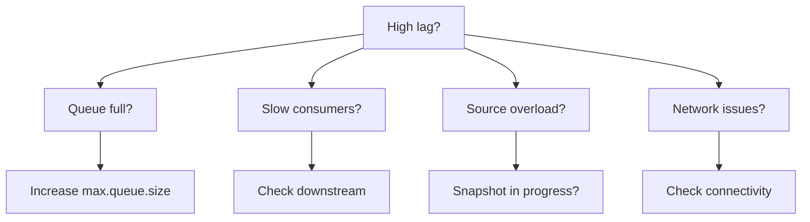

# Итоги модуля 4: Production Operations

## Что вы изучили

В этом модуле вы освоили production operations: мониторинг, alerting и troubleshooting Debezium в реальных условиях.

---

## Ключевые концепции

### JMX Metrics
- **MilliSecondsBehindSource**: Отставание от БД
- **MilliSecondsSinceLastEvent**: Время без событий
- **QueueRemainingCapacity**: Буфер событий

### Alert Thresholds
- **Warning**: lag > 30 секунд
- **Critical**: lag > 5 минут
- **Queue**: capacity < 20%

### Prometheus/Grafana
- **JMX Exporter**: Экспорт метрик
- **Dashboards**: Визуализация lag и throughput
- **Alerting rules**: Автоматические уведомления

### Disaster Recovery
- **Snapshot re-trigger**: signal.data.collection
- **Position reset**: Откат к известной позиции
- **Schema recovery**: Восстановление истории

---

## Diagnostic Decision Tree

---

## Навыки

После прохождения модуля вы умеете:

1. **Интерпретировать** JMX метрики Debezium
2. **Настроить** Prometheus scraping
3. **Создать** Grafana dashboards
4. **Настроить** alerting rules
5. **Выполнить** disaster recovery

---

## Что дальше?

**Модуль 5: SMT и Паттерны**

Трансформации и продвинутые паттерны:
- Single Message Transforms (SMT)
- Outbox pattern для transactional messaging
- Content-based routing
- Schema Registry и Avro

