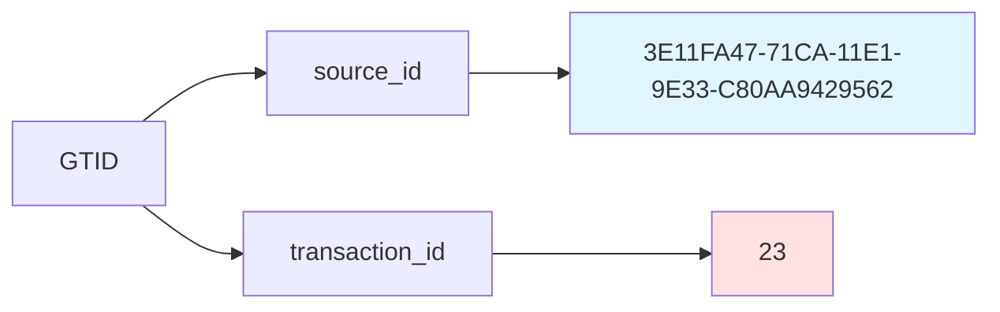
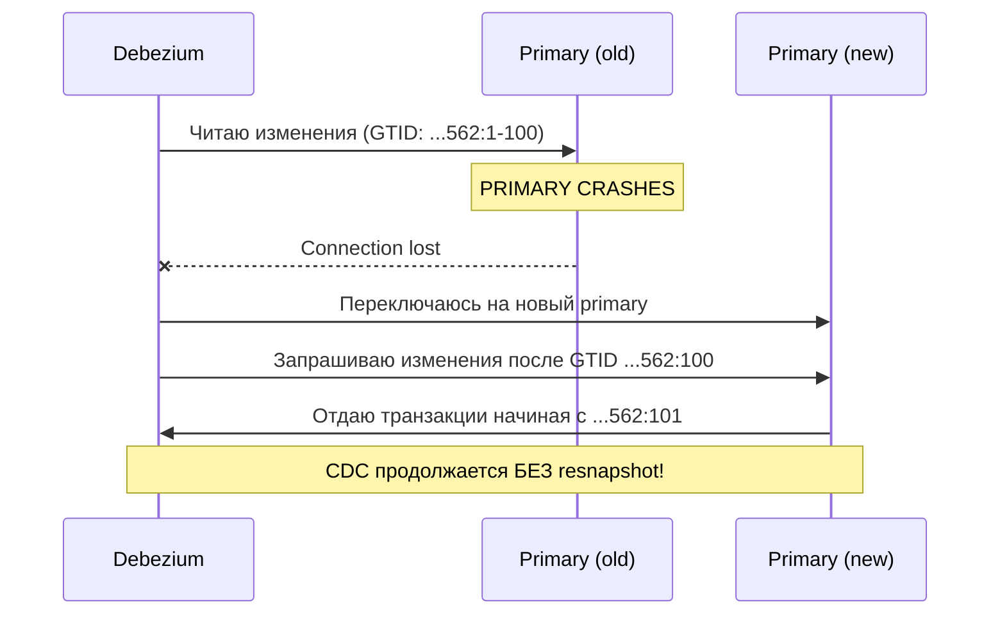
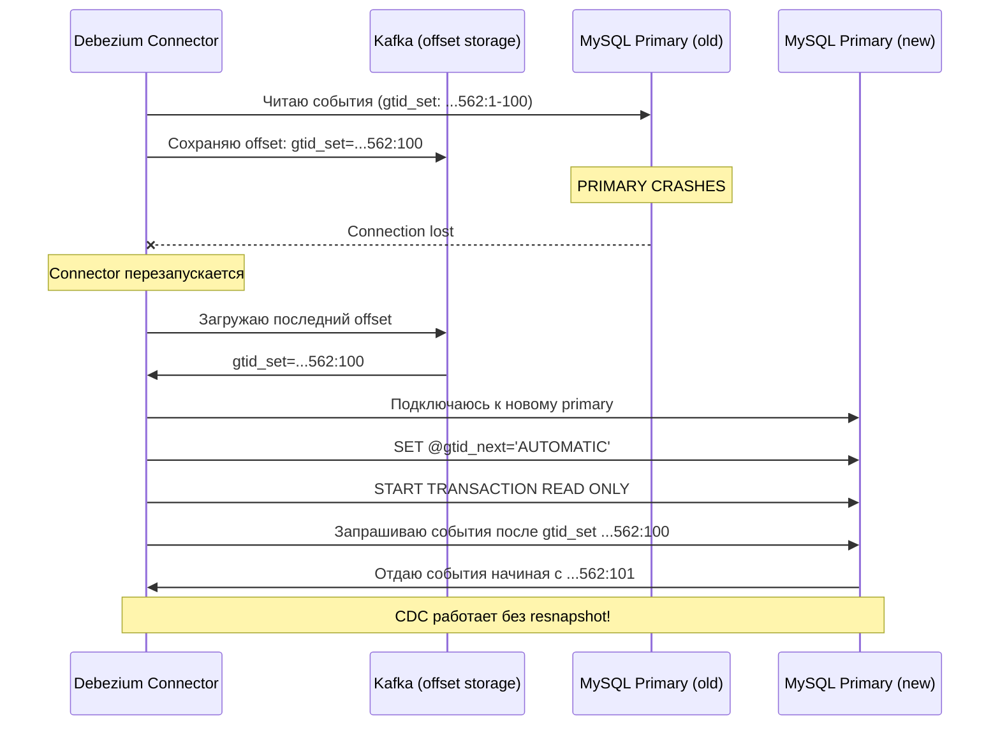

import Mermaid from '@/components/Mermaid.astro';
import Callout from '@/components/Callout.astro';

# GTID Mode: Глобальные идентификаторы транзакций

## Введение: Проблема отслеживания позиции

В предыдущих уроках мы изучили, как MySQL binlog записывает изменения данных в последовательность файлов (mysql-bin.000001, mysql-bin.000002, и так далее). Debezium отслеживает свою позицию в этом потоке, чтобы знать, какие изменения уже обработаны.

Традиционно позиция в binlog описывается двумя координатами:

- **Имя файла**: например, `mysql-bin.000003`
- **Смещение (offset)**: байтовая позиция внутри файла, например `154`

Полная позиция выглядит так: `mysql-bin.000003:154`

### Проблема при failover

Представьте сценарий:

1. Debezium читает изменения с primary сервера, текущая позиция: `mysql-bin.000003:154`
2. Primary сервер падает
3. Replica сервер становится новым primary (автоматический failover)
4. **На новом primary файлы binlog имеют другие имена и смещения!**
5. Позиция `mysql-bin.000003:154` на старом сервере **не соответствует** той же транзакции на новом сервере

Результат: Debezium не может продолжить чтение. Требуется **полный resnapshot** всей базы данных, что может занять часы или дни для больших таблиц.

### Решение: Global Transaction Identifiers (GTID)

GTID - это глобальные идентификаторы, которые **одинаковы на всех серверах в топологии репликации**. Транзакция с GTID `3E11FA47-71CA-11E1-9E33-C80AA9429562:23` имеет тот же самый идентификатор на primary, на всех replica, и после failover.

С GTID Debezium может сказать новому primary: "Дай мне все транзакции после `3E11FA47-...:23`", и продолжить работу без resnapshot.

## GTID: Анатомия идентификатора

GTID состоит из двух частей, разделенных двоеточием:

<Mermaid>

</Mermaid>

### source_id (Server UUID)

- **Формат**: UUID (Universally Unique Identifier)
- **Генерация**: Автоматически создается при первом запуске MySQL сервера
- **Хранится в**: `/var/lib/mysql/auto.cnf`
- **Уникальность**: Гарантированно уникален для каждого сервера в мире

Пример:
```
3E11FA47-71CA-11E1-9E33-C80AA9429562
```

### transaction_id (Sequence Number)

- **Формат**: Монотонно возрастающее целое число
- **Начинается с**: 1
- **Инкремент**: Каждая новая транзакция на данном сервере получает следующий номер
- **Свойство**: Числа никогда не используются повторно

Пример последовательности GTIDs с одного сервера:
```
3E11FA47-71CA-11E1-9E33-C80AA9429562:1
3E11FA47-71CA-11E1-9E33-C80AA9429562:2
3E11FA47-71CA-11E1-9E33-C80AA9429562:3
...
3E11FA47-71CA-11E1-9E33-C80AA9429562:100
```

### GTID Set (Диапазоны)

В реальности серверы работают с **GTID sets** - компактным представлением множества транзакций:

```
3E11FA47-71CA-11E1-9E33-C80AA9429562:1-100,
4E22GB58-82DB-22F2-AF44-D91BA0530673:1-50
```

Это означает:
- Сервер выполнил транзакции 1-100 от первого source_id
- И транзакции 1-50 от второго source_id (например, после failover, когда новый primary начал генерировать свои GTIDs)

Диапазоны можно записывать с пропусками:
```
3E11FA47-71CA-11E1-9E33-C80AA9429562:1-10:15-20
```
Это значит: транзакции 1-10 и 15-20 (11-14 отсутствуют или отфильтрованы).

## Почему GTID критичен для CDC

### 1. Failover Resilience (Устойчивость к failover)

<Mermaid>

</Mermaid>

Без GTID Debezium не сможет продолжить - он знает только файл и смещение на старом сервере, которые бессмысленны на новом.

С GTID Debezium просто запрашивает "все после последнего обработанного GTID", и MySQL знает, какие транзакции отдать.

### 2. Position Independence (Независимость от позиции)

Традиционная позиция: `mysql-bin.000003:154` - зависит от:
- Порядка файлов binlog
- Смещения внутри файла
- Конкретного сервера

GTID: `3E11FA47-...:23` - зависит только от:
- Самой транзакции
- Глобально уникален

Это позволяет Debezium переключаться между серверами без пересчета смещений.

### 3. Gap Detection (Обнаружение пропусков)

Если Debezium обработал GTIDs 1-100 и 102-105, он **видит**, что транзакция 101 отсутствует. Это может быть:
- Фильтрованная транзакция (например, изменение в системной таблице)
- Признак проблемы репликации

С file:offset обнаружить такие пропуски значительно сложнее.

### Сравнение с PostgreSQL LSN

Для контекста: PostgreSQL использует **LSN (Log Sequence Number)** - монотонно возрастающее число, которое является **локальным для сервера**. После failover в PostgreSQL также возникает проблема смены позиции, но PostgreSQL решает её через replication slots, которые отслеживаются на стороне сервера.

MySQL GTID - это клиентская модель: Debezium хранит GTID у себя, а любой MySQL сервер может продолжить с этого GTID. PostgreSQL replication slots - серверная модель: сервер хранит позицию для каждого клиента.

Обе модели решают проблему failover, но по-разному.

## Конфигурация GTID Mode

Для работы GTID требуется две настройки MySQL:

```bash
# Включить GTID mode
--gtid-mode=ON

# Принудительная согласованность GTID
--enforce-gtid-consistency=ON
```

В нашем `labs/docker-compose.yml` (который мы создали в предыдущем плане) эти настройки уже присутствуют:

```yaml
mysql:
  command:
    - "mysqld"
    - "--gtid-mode=ON"
    - "--enforce-gtid-consistency=ON"
    # ... другие параметры
```

### Что делает enforce-gtid-consistency?

Эта настройка **блокирует выполнение SQL-команд**, которые несовместимы с GTID mode. Почему?

GTID должен однозначно идентифицировать транзакцию. Некоторые SQL-операции создают **недетерминированные** или **неатомарные** ситуации, которые нельзя корректно воспроизвести на replica через GTID.

<Callout type="danger" title="Unsafe Statements (блокируются при enforce-gtid-consistency=ON)">

**CREATE TABLE ... SELECT**
```sql
CREATE TABLE new_table AS SELECT * FROM old_table;
```
Проблема: Это две операции в одной (CREATE + INSERT), которые должны быть атомарными, но могут не быть таковыми в GTID.

**Transactions mixing storage engines**
```sql
BEGIN;
UPDATE innodb_table SET value = 1;  -- InnoDB (transactional)
UPDATE myisam_table SET value = 2;  -- MyISAM (non-transactional)
COMMIT;
```
Проблема: MyISAM не поддерживает откат. Если транзакция откатится, состояние станет inconsistent.

**CREATE TEMPORARY TABLE inside transactions**
```sql
BEGIN;
CREATE TEMPORARY TABLE temp_data (id INT);
COMMIT;
```
Проблема: Временные таблицы не реплицируются одинаково через GTID.

</Callout>

Если попытаться выполнить такие команды при `enforce-gtid-consistency=ON`, MySQL вернет ошибку:

```
ERROR 1786 (HY000): Statement violates GTID consistency:
CREATE TABLE ... SELECT is forbidden when @@GLOBAL.ENFORCE_GTID_CONSISTENCY = ON.
```

### Почему enforce-gtid-consistency обязателен?

Технически можно включить `gtid-mode=ON` без `enforce-gtid-consistency=ON`, но это **крайне опасно**:

- Unsafe statements будут выполняться
- GTID будет назначен
- Replica может получить **другое состояние данных**, чем primary
- CDC через Debezium может получить **inconsistent events**

**Best practice**: Всегда включать `enforce-gtid-consistency=ON` вместе с `gtid-mode=ON`. Это защита от ошибок.

## GTID в действии: SQL команды

### Проверка GTID mode

Подключитесь к MySQL (из нашего docker-compose окружения):

```bash
docker compose exec mysql mysql -u root -pmysql
```

Проверьте, что GTID mode включен:

```sql
SHOW VARIABLES LIKE 'gtid_mode';
```

Ожидаемый результат:
```
+---------------+-------+
| Variable_name | Value |
+---------------+-------+
| gtid_mode     | ON    |
+---------------+-------+
```

Проверьте enforce-gtid-consistency:

```sql
SHOW VARIABLES LIKE 'enforce_gtid_consistency';
```

Ожидаемый результат:
```
+--------------------------+-------+
| Variable_name            | Value |
+--------------------------+-------+
| enforce_gtid_consistency | ON    |
+--------------------------+-------+
```

### Просмотр выполненных GTIDs

```sql
SHOW GLOBAL VARIABLES LIKE 'gtid_executed';
```

Пример вывода:
```
+---------------+------------------------------------------+
| Variable_name | Value                                    |
+---------------+------------------------------------------+
| gtid_executed | 3E11FA47-71CA-11E1-9E33-C80AA9429562:1-7 |
+---------------+------------------------------------------+
```

Это означает: Сервер выполнил транзакции с 1 по 7 от данного source_id.

Если выполнить новую транзакцию:

```sql
USE inventory;
CREATE TABLE test_gtid (id INT PRIMARY KEY, value VARCHAR(50));
INSERT INTO test_gtid VALUES (1, 'test');
COMMIT;
```

И снова проверить:

```sql
SHOW GLOBAL VARIABLES LIKE 'gtid_executed';
```

Результат:
```
+---------------+------------------------------------------+
| Variable_name | Value                                    |
+---------------+------------------------------------------+
| gtid_executed | 3E11FA47-71CA-11E1-9E33-C80AA9429562:1-9 |
+---------------+------------------------------------------+
```

Диапазон расширился до 1-9 (добавились CREATE TABLE и INSERT как отдельные GTIDs).

### Просмотр purged GTIDs

**Критически важная метрика для CDC!**

```sql
SHOW GLOBAL VARIABLES LIKE 'gtid_purged';
```

Пример вывода:
```
+---------------+------------------------------------------+
| Variable_name | Value                                    |
+---------------+------------------------------------------+
| gtid_purged   | 3E11FA47-71CA-11E1-9E33-C80AA9429562:1-5 |
+---------------+------------------------------------------+
```

Это означает: Binlog файлы, содержащие GTIDs 1-5, **уже удалены** (purged) из-за истечения срока хранения (binlog_expire_logs_seconds).

**Если Debezium нуждается в GTIDs из purged диапазона** (например, его offset указывает на GTID 4, но gtid_purged уже начинается с 1-5), то:

<Callout type="danger" title="Position Lost - Требуется Resnapshot">

Debezium не может продолжить чтение, потому что нужные транзакции больше не существуют в binlog.

**Решение**: Запустить полный resnapshot (snapshot.mode=initial), что может занять часы для больших баз данных.

**Профилактика**: Настроить heartbeat events (мы изучим в следующем уроке), чтобы Debezium постоянно обновлял свою позицию даже на idle таблицах.

</Callout>

## GTID vs File Position: Конфигурация Debezium

Debezium MySQL connector **автоматически использует GTID**, если обнаруживает, что `gtid_mode=ON` на сервере.

### Хранение позиции: schema history topic

Debezium сохраняет свой offset (позицию в binlog) в двух местах:

1. **Kafka Connect offset storage** (для offset tracking)
2. **schema.history.internal.kafka.topic** (для schema changes и GTID)

Пример конфигурации connector:

```json
{
  "name": "mysql-connector",
  "config": {
    "connector.class": "io.debezium.connector.mysql.MySqlConnector",
    "database.hostname": "mysql",
    "database.port": "3306",
    "database.user": "debezium",
    "database.password": "dbz",
    "database.server.id": "184054",
    "database.server.name": "mysql-server",
    "table.include.list": "inventory.*",

    "schema.history.internal.kafka.topic": "schema-changes.mysql",
    "schema.history.internal.kafka.bootstrap.servers": "kafka:9092"
  }
}
```

В Kafka offset topic запись для GTID-enabled connector выглядит так (упрощенно):

```json
{
  "gtid_set": "3E11FA47-71CA-11E1-9E33-C80AA9429562:1-100",
  "binlog_filename": "mysql-bin.000003",
  "binlog_position": 154
}
```

Debezium хранит **и GTID, и file:position** для обратной совместимости, но **приоритет отдается GTID**, если он доступен.

### Failover scenario с Debezium

<Mermaid>

</Mermaid>

Ключевой момент: Debezium может переключиться на новый primary, используя тот же самый GTID, потому что GTID глобально уникален.

## Common GTID Pitfalls (Типичные ошибки)

### 1. enforce-gtid-consistency=OFF

**Симптом**: Репликация работает, но периодически ломается с ошибками inconsistency.

**Причина**: Unsafe statements выполняются и создают разное состояние на primary и replica.

**Решение**: Всегда включать `enforce-gtid-consistency=ON`.

### 2. gtid_purged растет, а Debezium не отслеживает

**Симптом**: Debezium был offline несколько дней. При перезапуске ошибка: "Cannot replicate because the master purged required binary logs."

**Причина**: Binlog файлы с нужными GTIDs были удалены (expired) из-за binlog_expire_logs_seconds.

**Решение**:
- Увеличить binlog_expire_logs_seconds (больше retention)
- Настроить heartbeat events (следующий урок)
- Мониторить `gtid_purged` и алертить, если он приближается к offset Debezium

### 3. Mixing GTID и non-GTID серверов в топологии

**Симптом**: Некоторые replica серверы в топологии имеют gtid_mode=OFF, другие gtid_mode=ON.

**Причина**: Постепенная миграция на GTID или устаревшие replica.

**Проблема**: Debezium не может надежно работать в такой топологии. Failover может привести на non-GTID сервер.

**Решение**: Включить GTID на всех серверах в топологии. MySQL поддерживает online GTID migration (gtid_mode=OFF -> OFF_PERMISSIVE -> ON_PERMISSIVE -> ON).

## Key Takeaways

- **GTID (Global Transaction Identifier)** - глобально уникальный идентификатор транзакции в формате `source_id:transaction_id`
- **source_id** - UUID сервера, уникален для каждого MySQL instance
- **transaction_id** - монотонно возрастающий номер транзакции на данном сервере
- **GTID Sets** - компактное представление множества GTIDs в виде диапазонов (например, `...562:1-100`)
- **Failover resilience** - Debezium может продолжить чтение с нового primary, используя тот же GTID
- **Конфигурация**: `gtid-mode=ON` + `enforce-gtid-consistency=ON` (обе настройки обязательны)
- **enforce-gtid-consistency** блокирует unsafe statements (CREATE TABLE...SELECT, смешивание storage engines)
- **gtid_executed** - все транзакции, которые сервер выполнил
- **gtid_purged** - транзакции, для которых binlog уже удален (критическая метрика для CDC)
- Если Debezium нуждается в purged GTIDs -> требуется full resnapshot
- Debezium автоматически использует GTID, если `gtid_mode=ON` на MySQL сервере
- GTID хранится в Kafka offset storage вместе с file:position для обратной совместимости

## Что дальше?

Мы разобрались с GTID - механизмом, который позволяет Debezium продолжать работу после failover.

В следующем уроке мы изучим:

- **Binlog Retention**: Как настроить `binlog_expire_logs_seconds` так, чтобы не потерять позицию
- **Heartbeat Events**: Как предотвратить purge binlog файлов, на которые указывает Debezium offset, даже если таблицы idle
- **Мониторинг binlog health**: Какие метрики отслеживать, чтобы избежать катастрофы position loss

Эти темы критически важны для production CDC deployment.
