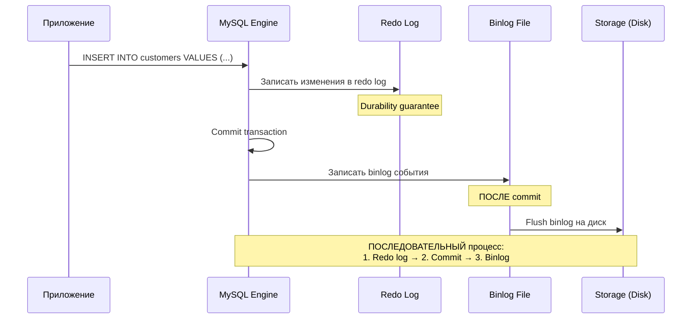
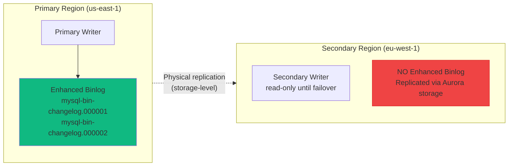
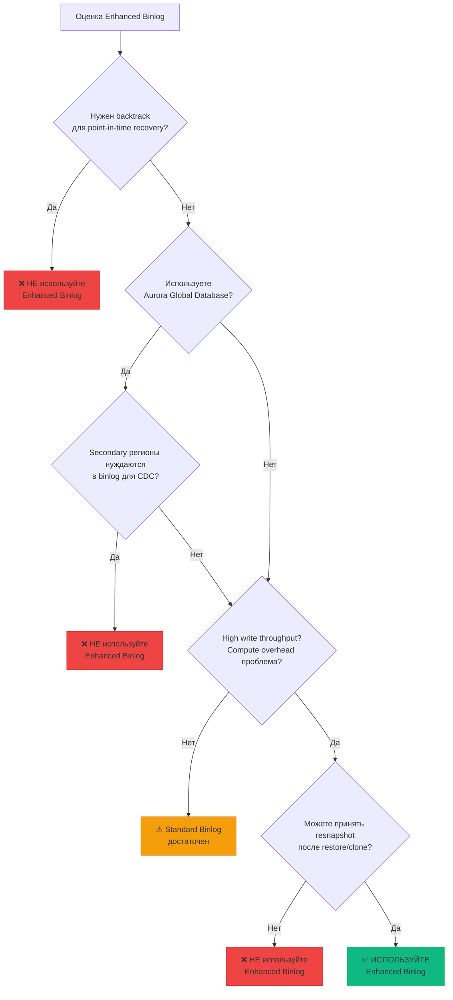

import { Mermaid } from '../../../components/Mermaid.tsx';
import Callout from '../../../components/Callout.tsx';

# Aurora Enhanced Binlog: Архитектура и Trade-offs

## Введение: Зачем Aurora переосмыслила binlog

В **Уроке 01** мы изучили традиционную архитектуру MySQL binary log: движок последовательно записывает данные в redo log, фиксирует транзакцию, затем записывает события в binlog файлы. Этот подход работает, но имеет существенные накладные расходы — для рабочих нагрузок с активной записью binlog может создавать до **50% дополнительной вычислительной нагрузки**.

**Aurora MySQL 3.03.1+** (выпущена в мае 2023) представила инновацию — **Enhanced Binlog**, который фундаментально изменил способ хранения binlog событий. Вместо того, чтобы MySQL движок последовательно писал в binlog файлы, Aurora теперь использует **специализированные storage nodes**, которые принимают binlog события параллельно с записью в transaction log.

### Для кого этот урок критичен

- **Production CDC окружения** с высокой нагрузкой на запись
- **AWS Aurora MySQL пользователи**, оценивающие Enhanced Binlog для снижения compute overhead
- **Архитекторы**, принимающие решения о backtrack, Aurora Global Database или snapshot стратегиях
- **Инженеры**, настраивающие Debezium для Aurora и планирующие disaster recovery

### Что важно понять

**Enhanced Binlog не меняет протокол Debezium.** Ваш Debezium MySQL connector будет читать binlog через стандартный MySQL binlog protocol. Изменения происходят на стороне **Aurora storage layer** — параллельные записи, специализированное хранилище, более быстрая recovery.

Но Enhanced Binlog имеет **критические ограничения**, которые делают его несовместимым с некоторыми Aurora функциями. Это урок о том, как принять взвешенное решение.

## Standard Binlog Architecture (Baseline)

Для понимания инновации Enhanced Binlog сначала вспомним, как работает стандартный binlog в Community MySQL и Aurora.

### Последовательная запись событий

<Mermaid>

</Mermaid>

### Характеристики стандартного binlog

| Аспект | Standard Binlog |
|--------|----------------|
| **Порядок записи** | Последовательный: transaction log → commit → binlog |
| **Storage backend** | Обычные файлы на диске (mysql-bin.000001, mysql-bin.000002, ...) |
| **Compute overhead** | ~50% для workloads с активным binlog |
| **Восстановление после failover** | Зависит от времени replay binlog событий |
| **Сложность** | Простая, понятная модель |

### Проблема: Binlog как bottleneck

При высокой интенсивности записи binlog становится узким местом:

1. **Транзакция не может завершиться до записи в binlog** — даже если данные уже в redo log
2. **Binlog записывается последовательно** — каждое событие ждёт предыдущего
3. **Compute ресурсы тратятся на сортировку и упорядочивание** binlog событий

Для рабочих нагрузок с тысячами транзакций в секунду это значительная проблема.

## Enhanced Binlog Architecture: Ключевая инновация

Aurora Enhanced Binlog решает проблему через **разделение ответственности** и **параллелизм**.

### Параллельные записи в специализированное хранилище

```mermaid
graph TB
    subgraph ENGINE["MySQL Engine (Compute Node)"]
        direction TB
        TX[Transaction Execution]
        TX --> TL[Transaction Log Events]
        TX --> BL[Binlog Events<br/>UNSORTED]
    end

    subgraph STORAGE["Aurora Storage Layer"]
        direction TB
        subgraph STANDARD["Standard Storage Nodes"]
            TLS[Transaction Log Storage]
        end
        subgraph ENHANCED["Enhanced Binlog Storage Nodes<br/>SPECIALIZED"]
            BLS[Binlog Storage]
            SORT[Sorting & Ordering<br/>at Storage Layer]
            BLS --> SORT
        end
    end

    TL -.->|"Parallel Write #1"| TLS
    BL -.->|"Parallel Write #2"| BLS

    SORT --> OUTPUT["Ordered Binlog Files<br/>mysql-bin-changelog.000001"]

    style ENGINE fill:#1e3a5f,stroke:#3b82f6
    style ENHANCED fill:#10b981,stroke:#22c55e
    style SORT fill:#f59e0b
```

<Mermaid>

</Mermaid>

### Как это работает

1. **MySQL движок генерирует события одновременно**
   - Transaction log события → standard storage nodes
   - Binlog события (несортированные) → **Enhanced Binlog storage nodes**

2. **Storage nodes выполняют сортировку**
   - Binlog storage nodes получают несортированные события
   - Упорядочивание происходит на уровне хранилища (не на compute)
   - Движок освобождается от этой работы

3. **Debezium читает через стандартный протокол**
   - Enhanced Binlog expose binlog через обычный MySQL binlog protocol
   - Никаких изменений в Debezium connector не требуется
   - Binlog файлы выглядят как обычные (но именуются `mysql-bin-changelog.*`)

### Ключевое отличие от стандартного binlog

| Аспект | Standard Binlog | Enhanced Binlog |
|--------|----------------|-----------------|
| **Запись событий** | Последовательная (после commit) | Параллельная с transaction log |
| **Сортировка** | На compute node (MySQL engine) | На storage nodes |
| **Файловое именование** | `mysql-bin.000001` | `mysql-bin-changelog.000001` |
| **Debezium protocol** | MySQL binlog | MySQL binlog (без изменений) |
| **max_binlog_size** | 128 MB (default) | 256 MB (read-only, auto-changed) |

<Callout type="tip">
**Для Debezium это прозрачно:** Ваш connector продолжает читать binlog через стандартный MySQL протокол. Enhanced Binlog — это оптимизация на стороне Aurora storage, невидимая для клиента.
</Callout>

## Performance Claims: Анализ официальных цифр AWS

AWS публикует следующие улучшения производительности Enhanced Binlog в официальном блоге:

### 99% улучшение recovery времени

**Сценарий:** Восстановление Aurora кластера после restart или failover.

- **Standard binlog:** Движок должен replay binlog события для восстановления состояния
- **Enhanced binlog:** Storage nodes уже имеют упорядоченные события, replay быстрее

**Пример из AWS блога:**
- Standard binlog recovery: ~10 минут
- Enhanced binlog recovery: ~6 секунд
- Улучшение: **99%**

### Compute overhead: 50% → 13%

**Сценарий:** Workload с активным binlog (тысячи write операций в секунду).

- **Standard binlog:** MySQL движок тратит ~50% CPU времени на запись, сортировку, flush binlog
- **Enhanced binlog:** Движок делегирует сортировку storage nodes, overhead падает до ~13%

**Что это означает для ваших инстансов:**
- Вы можете обрабатывать больше транзакций на том же инстансе
- Или использовать инстанс меньшего размера (экономия затрат)

### 40% прирост throughput на concurrent workloads

**Сценарий:** Высоко параллельные write операции (множество одновременных транзакций).

AWS тестировал sysbench с множеством потоков записи:

- **Standard binlog:** 10,000 transactions/sec
- **Enhanced binlog:** 14,000 transactions/sec
- Прирост: **40%**

### CloudWatch Metrics для мониторинга

Aurora предоставляет специфичные метрики для Enhanced Binlog:

| Метрика | Описание | Когда мониторить |
|---------|----------|------------------|
| `ChangeLogBytesUsed` | Использование storage Enhanced Binlog (байты) | Рост хранилища, capacity planning |
| `ChangeLogReadIOPs` | Read operations на Enhanced Binlog storage за 5 минут | Debezium throughput, bottleneck анализ |
| `ChangeLogWriteIOPs` | Write operations на Enhanced Binlog storage за 5 минут | Write load, storage saturation |

<Callout type="note">
**Контекст цифр:** Все приведённые улучшения (99%, 40%, 50% → 13%) взяты из официального AWS блога. Независимые бенчмарки не проводились. В реальных production сценариях результаты могут варьироваться в зависимости от workload характеристик.
</Callout>

## Critical Limitations: Что НЕОБХОДИМО знать

Enhanced Binlog имеет **три критических ограничения**, которые делают его несовместимым с некоторыми Aurora функциями. Эти ограничения **постоянны** — вы не можете отменить решение задним числом.

### 1. Backtrack Incompatibility (PERMANENT)

<Callout type="danger">
**КРИТИЧЕСКОЕ ОГРАНИЧЕНИЕ:** Если ваш Aurora кластер **когда-либо имел включённый backtrack** (даже если сейчас он выключен), вы **НЕ МОЖЕТЕ** включить Enhanced Binlog. Это ограничение необратимо.
</Callout>

**Что такое backtrack:**
- Aurora функция для точечного отката кластера на предыдущее состояние (в пределах окна, например, 72 часа)
- Не требует создания snapshot, откат занимает минуты
- Полезна для восстановления после ошибочных операций (случайный DELETE, неправильный UPDATE)

**Почему несовместимо:**
- Enhanced Binlog хранит события в специализированных storage nodes
- Backtrack изменяет состояние transaction log, но не синхронизируется с Enhanced Binlog storage
- После backtrack binlog события становятся несогласованными с данными

**Как проверить, можно ли включить Enhanced Binlog:**

```sql
-- Проверить, был ли когда-либо включён backtrack
SHOW VARIABLES LIKE 'aurora_lab_mode';
-- Если значение содержит 'AuroraLabModeBinlogTransactionCompression',
-- это означает, что кластер имеет binlog настройки.

-- Безопаснее проверить через AWS CLI:
aws rds describe-db-clusters \
  --db-cluster-identifier my-aurora-cluster \
  --query 'DBClusters[0].BacktrackWindow'

-- Если BacktrackWindow > 0 (даже если backtrack не используется),
-- Enhanced Binlog НЕЛЬЗЯ включить
```

**Decision point:**
- **Нужен backtrack для point-in-time recovery тестов?** → Не используйте Enhanced Binlog
- **Нужен низкий compute overhead для CDC?** → Не используйте backtrack

### 2. Not in Aurora Backups

<Callout type="warning">
**ВАЖНО:** Enhanced Binlog файлы **НЕ включаются** в Aurora snapshots, automated backups или cloned кластеры. После restore/clone binlog последовательность начинается заново с `.000001`.
</Callout>

**Что это означает:**

1. **Aurora automated backup создаётся каждый день**
   - Snapshot содержит данные таблиц
   - Snapshot **НЕ содержит** Enhanced Binlog файлов

2. **Вы восстанавливаете кластер из backup**
   - Данные восстановлены к моменту snapshot
   - Binlog начинается с `mysql-bin-changelog.000001` (свежий лог)

3. **Debezium offset содержит старую binlog позицию**
   - Offset: `mysql-bin-changelog.000045:1234`
   - Новый кластер имеет только `mysql-bin-changelog.000001:4`
   - **Debezium не может продолжить CDC** — binlog позиция потеряна

**Решение для disaster recovery:**

```properties
# После восстановления из Aurora backup:
# 1. Остановить Debezium connector
# 2. Выполнить resnapshot с новой binlog позиции

snapshot.mode=initial
# Debezium создаст новый snapshot и начнёт CDC с текущей позиции
```

**Альтернатива для больших таблиц:**
- Используйте **incremental snapshot** (Debezium 1.6+) для постепенного обновления данных
- Или bulk load данных через Aurora clone, затем `snapshot.mode=never` с новой позиции

### 3. Aurora Global Database: No Binlog Replication

<Callout type="warning">
**ВАЖНО:** В Aurora Global Database Enhanced Binlog файлы **НЕ реплицируются** в secondary регионы. После failover на secondary регион binlog начинается с `.000001`.
</Callout>

**Aurora Global Database architecture:**

<Mermaid>

</Mermaid>

**Что происходит при failover:**

1. **Перед failover:** Primary region в `us-east-1`, Debezium читает binlog
   - Debezium offset: `mysql-bin-changelog.000123:45678`

2. **Failover на secondary region** `eu-west-1`
   - Secondary становится новым primary
   - Binlog начинается с `mysql-bin-changelog.000001` (нет старых файлов)

3. **Debezium не может продолжить**
   - Старая позиция `000123:45678` не существует на новом primary
   - Требуется resnapshot

**Решение для Global Database:**
- **Не используйте Enhanced Binlog** если планируете failover на другой регион
- Или примите, что после failover потребуется resnapshot (длительный downtime для CDC)

### 4. max_binlog_size: Read-Only

Минорное ограничение, но важно знать:

```sql
-- Enhanced Binlog автоматически меняет max_binlog_size
SHOW VARIABLES LIKE 'max_binlog_size';
-- +------------------+-----------+
-- | Variable_name    | Value     |
-- +------------------+-----------+
-- | max_binlog_size  | 268435456 |  -- 256 MB (было 128 MB)
-- +------------------+-----------+

-- Попытка изменить значение не сработает
SET GLOBAL max_binlog_size = 134217728;  -- Попытка установить 128 MB
-- ERROR: max_binlog_size is read-only when Enhanced Binlog enabled
```

**Что это означает:**
- Aurora контролирует размер binlog файлов для оптимизации storage
- Вы не можете уменьшить или увеличить значение
- Для большинства сценариев это не проблема

## Enabling Enhanced Binlog: Hands-On

Включение Enhanced Binlog требует изменения DB cluster parameter group и reboot всех инстансов.

### Prerequisites Check

**Шаг 1: Проверить версию Aurora**

```sql
SELECT AURORA_VERSION();
-- Ожидается: 3.03.1 или выше
-- Пример: 3.09.0 (Aurora MySQL 8.0.40)
```

Если версия ниже 3.03.1, Enhanced Binlog недоступен.

**Шаг 2: Убедиться, что backtrack никогда не был включён**

```bash
aws rds describe-db-clusters \
  --db-cluster-identifier my-aurora-cluster \
  --query 'DBClusters[0].BacktrackWindow'

# Output:
# 0  ✅ Можно включать Enhanced Binlog
# > 0  ❌ НЕЛЬЗЯ включать Enhanced Binlog
```

**Шаг 3: Убедиться, что Global Database не используется (или допустимо отсутствие binlog в secondary регионах)**

### Parameter Group Configuration

**Создайте custom DB cluster parameter group (если ещё нет):**

```bash
aws rds create-db-cluster-parameter-group \
  --db-cluster-parameter-group-name aurora-mysql-enhanced-binlog \
  --db-parameter-group-family aurora-mysql8.0 \
  --description "Aurora MySQL with Enhanced Binlog for Debezium"
```

**Установите необходимые параметры:**

```bash
# 1. Включить Enhanced Binlog
aws rds modify-db-cluster-parameter-group \
  --db-cluster-parameter-group-name aurora-mysql-enhanced-binlog \
  --parameters "ParameterName=aurora_enhanced_binlog,ParameterValue=1,ApplyMethod=pending-reboot"

# 2. Установить binlog_format=ROW (обязательно для CDC)
aws rds modify-db-cluster-parameter-group \
  --db-cluster-parameter-group-name aurora-mysql-enhanced-binlog \
  --parameters "ParameterName=binlog_format,ParameterValue=ROW,ApplyMethod=pending-reboot"

# 3. ОТКЛЮЧИТЬ binlog backup (MUST для Enhanced Binlog)
aws rds modify-db-cluster-parameter-group \
  --db-cluster-parameter-group-name aurora-mysql-enhanced-binlog \
  --parameters "ParameterName=binlog_backup,ParameterValue=0,ApplyMethod=pending-reboot"

# 4. ОТКЛЮЧИТЬ binlog replication для Global Database
aws rds modify-db-cluster-parameter-group \
  --db-cluster-parameter-group-name aurora-mysql-enhanced-binlog \
  --parameters "ParameterName=binlog_replication_globaldb,ParameterValue=0,ApplyMethod=pending-reboot"
```

**Ассоциировать parameter group с кластером:**

```bash
aws rds modify-db-cluster \
  --db-cluster-identifier my-aurora-cluster \
  --db-cluster-parameter-group-name aurora-mysql-enhanced-binlog \
  --apply-immediately
```

### Reboot Instances

<Callout type="warning">
**ВАЖНО:** Для применения cluster parameter group необходимо перезагрузить **ВСЕ инстансы** (writer + все readers). В Aurora 2.10+ readers не перезагружаются автоматически.
</Callout>

```bash
# 1. Reboot writer instance
aws rds reboot-db-instance \
  --db-instance-identifier my-aurora-instance-1-writer

# 2. Reboot ALL reader instances (Aurora 2.10+)
aws rds reboot-db-instance \
  --db-instance-identifier my-aurora-instance-2-reader

aws rds reboot-db-instance \
  --db-instance-identifier my-aurora-instance-3-reader
```

**Downtime:** Writer reboot занимает ~2-5 минут. Reader reboot происходит параллельно.

### Verification: Проверка активации

**Проверить статус Enhanced Binlog:**

```sql
SHOW STATUS LIKE 'aurora_enhanced_binlog';
-- +------------------------+--------+
-- | Variable_name          | Value  |
-- +------------------------+--------+
-- | aurora_enhanced_binlog | ACTIVE |
-- +------------------------+--------+
```

Если видите `INACTIVE` — parameter group не применён или инстанс не был перезагружен.

**Проверить именование binlog файлов:**

```sql
SHOW BINARY LOGS;
-- +---------------------------+-----------+
-- | Log_name                  | File_size |
-- +---------------------------+-----------+
-- | mysql-bin-changelog.000001| 177       |
-- | mysql-bin-changelog.000002| 1548      |
-- +---------------------------+-----------+
```

**Enhanced Binlog использует префикс `mysql-bin-changelog`** вместо `mysql-bin`.

**Проверить max_binlog_size (должно быть 256MB):**

```sql
SHOW VARIABLES LIKE 'max_binlog_size';
-- +------------------+-----------+
-- | Variable_name    | Value     |
-- +------------------+-----------+
-- | max_binlog_size  | 268435456 |  -- 256 MB
-- +------------------+-----------+
```

**Проверить binlog_backup (должно быть OFF):**

```sql
SHOW VARIABLES LIKE 'binlog_backup';
-- +---------------+-------+
-- | Variable_name | Value |
-- +---------------+-------+
-- | binlog_backup | 0     |  -- Disabled
-- +---------------+-------+
```

<Callout type="tip">
После включения Enhanced Binlog ваш Debezium connector продолжит работать без изменений. Connector увидит новую binlog последовательность `mysql-bin-changelog.000001` и начнёт читать с неё.
</Callout>

## Disabling Enhanced Binlog: Если нужно вернуться

Вы можете отключить Enhanced Binlog, но это **начнёт новую binlog последовательность** — Debezium потребуется resnapshot.

### Reverse Parameter Changes

```bash
# 1. Отключить Enhanced Binlog
aws rds modify-db-cluster-parameter-group \
  --db-cluster-parameter-group-name aurora-mysql-enhanced-binlog \
  --parameters "ParameterName=aurora_enhanced_binlog,ParameterValue=0,ApplyMethod=pending-reboot"

# 2. Включить binlog backup (если нужно)
aws rds modify-db-cluster-parameter-group \
  --db-cluster-parameter-group-name aurora-mysql-enhanced-binlog \
  --parameters "ParameterName=binlog_backup,ParameterValue=1,ApplyMethod=pending-reboot"

# 3. Включить binlog_replication_globaldb (если нужно)
aws rds modify-db-cluster-parameter-group \
  --db-cluster-parameter-group-name aurora-mysql-enhanced-binlog \
  --parameters "ParameterName=binlog_replication_globaldb,ParameterValue=1,ApplyMethod=pending-reboot"
```

### Reboot и Verification

```bash
# Reboot writer и все readers
aws rds reboot-db-instance --db-instance-identifier my-aurora-instance-1-writer
aws rds reboot-db-instance --db-instance-identifier my-aurora-instance-2-reader
```

```sql
SHOW STATUS LIKE 'aurora_enhanced_binlog';
-- +------------------------+----------+
-- | Variable_name          | Value    |
-- +------------------------+----------+
-- | aurora_enhanced_binlog | INACTIVE |
-- +------------------------+----------+

SHOW BINARY LOGS;
-- +------------------+-----------+
-- | Log_name         | File_size |
-- +------------------+-----------+
-- | mysql-bin.000001 | 154       |  -- Новая последовательность с .000001
-- +------------------+-----------+
```

<Callout type="warning">
**Debezium offset станет невалидным:** Старые offset содержат `mysql-bin-changelog.000045`, но новый binlog начинается с `mysql-bin.000001`. Connector потребует resnapshot.
</Callout>

### Debezium Resnapshot Strategy

**Вариант 1: Полный resnapshot (простой, долгий)**

```properties
# Остановить connector, изменить конфигурацию
snapshot.mode=initial
# Удалить старые offset (через Kafka Connect REST API или topic)
# Запустить connector — выполнится новый snapshot
```

**Вариант 2: Incremental snapshot (Debezium 1.6+, быстрее)**

```sql
-- Вставить сигнал для incremental snapshot всех таблиц
INSERT INTO inventory.debezium_signal (id, type, data)
VALUES ('resnapshot-001', 'execute-snapshot', '{"data-collections": ["inventory.customers", "inventory.orders"]}');
```

Debezium постепенно обновит данные без полного snapshot downtime.

## Decision Matrix: Enhanced vs Standard Binlog

Как решить, использовать ли Enhanced Binlog? Используйте эту таблицу для оценки вашего сценария.

| Use Case | Enhanced Binlog? | Rationale |
|----------|------------------|-----------|
| **Высокая write throughput, production CDC** | ✅ **Да** | 13% compute overhead vs 50%; 40% прирост throughput |
| **Нужен backtrack для point-in-time testing** | ❌ **Нет** | Несовместимо — backtrack блокирует Enhanced Binlog |
| **Aurora Global Database с cross-region failover** | ❌ **Нет** | Binlog не реплицируется в secondary регион, после failover требуется resnapshot |
| **Нужен binlog в backups для disaster recovery** | ❌ **Нет** | Enhanced Binlog не включается в Aurora snapshots, после restore binlog теряется |
| **Стандартная workload, простота важнее оптимизации** | ❌ **Нет** | Standard binlog проще, без ограничений backtrack/Global Database |
| **Single-region Aurora, high concurrency, no backtrack** | ✅ **Да** | Ideal scenario для Enhanced Binlog |
| **Development/testing окружение с frequent clones** | ❌ **Нет** | Clone не содержит Enhanced Binlog, каждый clone требует resnapshot |
| **CDC + Aurora automated backups для DR** | ❌ **Нет** | После restore binlog позиция потеряна |

### Decision Flowchart

<Mermaid>

</Mermaid>

<Callout type="tip">
**Золотое правило:** Если у вас есть сомнения или вы не уверены в будущих требованиях (backtrack, Global Database, DR через backups), **начните с standard binlog**. Переход с standard на Enhanced возможен, но обратный переход потребует Debezium resnapshot.
</Callout>

## Impact on CDC: Что меняется для Debezium

### Что НЕ меняется (хорошая новость)

1. **Debezium connector конфигурация:** Без изменений
   - `database.hostname`, `database.port`, `database.user` — те же
   - `snapshot.mode`, `snapshot.locking.mode` — те же
   - `schema.history.internal.kafka.topic` — тот же

2. **Binlog read protocol:** MySQL binlog protocol (стандартный)
   - Debezium не "знает", что binlog хранится на Enhanced storage
   - Чтение происходит через тот же `COM_BINLOG_DUMP` command

3. **Event structure:** TABLE_MAP, WRITE_ROWS, UPDATE_ROWS, DELETE_ROWS
   - Формат событий идентичен standard binlog

### Что меняется

1. **Binlog file naming:**
   - Standard: `mysql-bin.000001`
   - Enhanced: `mysql-bin-changelog.000001`
   - Debezium offset хранит имя файла, но для connector это прозрачно

2. **max_binlog_size:** 256 MB вместо 128 MB
   - Файлы ротируются реже (при достижении 256 MB)
   - Debezium читает чуть большие файлы (незначительное изменение)

3. **Recovery после Aurora restart/failover:** Быстрее для Aurora, без изменений для Debezium
   - Aurora восстанавливается на 99% быстрее
   - Debezium продолжает чтение с сохранённого offset

### После Aurora Restore или Clone: CRITICAL

<Callout type="danger">
**КРИТИЧНО:** После восстановления Aurora кластера из backup или создания clone Enhanced Binlog файлы **не сохраняются**. Binlog начинается с `.000001`.
</Callout>

**Что происходит с Debezium:**

1. **Перед restore:** Debezium offset = `mysql-bin-changelog.000045:12345`
2. **После restore:** Новый кластер имеет `mysql-bin-changelog.000001:4`
3. **Debezium пытается прочитать** offset `000045:12345` → файл не существует
4. **Connector fails** с ошибкой: "Binlog file not found"

**Решение:**

**Подход 1: Resnapshot (простой, работает всегда)**

```properties
# Изменить connector конфигурацию
snapshot.mode=initial

# Удалить старые offset (через Kafka Connect API)
curl -X DELETE http://localhost:8083/connectors/aurora-mysql-connector/offsets
```

Debezium выполнит новый snapshot и начнёт CDC с текущей binlog позиции.

**Подход 2: Manual offset reset (для экспертов)**

```bash
# Получить текущую binlog позицию на новом кластере
mysql> SHOW MASTER STATUS;
-- mysql-bin-changelog.000001 | 154

# Вручную обновить Debezium offset topic
# (сложно, требует знания Kafka offset формата)
```

**Подход 3: Incremental snapshot (Debezium 1.6+, минимальный downtime)**

```sql
-- Вставить сигнал для incremental snapshot
INSERT INTO inventory.debezium_signal (id, type, data)
VALUES ('post-restore-resnapshot', 'execute-snapshot', '{"data-collections": ["inventory.*"]}');
```

Debezium постепенно обновит данные, не останавливая CDC поток.

## Key Takeaways

1. **Enhanced Binlog — storage-level optimization**
   - Параллельные записи в специализированные storage nodes
   - Сортировка на уровне хранилища, не на compute
   - 99% улучшение recovery, 50% → 13% compute overhead, +40% throughput

2. **Debezium connector работает без изменений**
   - Стандартный MySQL binlog protocol
   - Только именование файлов изменяется (`mysql-bin-changelog.*`)
   - Конфигурация connector остаётся идентичной

3. **Три критических ограничения:**
   - **Backtrack incompatibility** — если backtrack когда-либо был включён, Enhanced Binlog недоступен
   - **Not in backups** — после restore/clone binlog теряется, требуется Debezium resnapshot
   - **No Global Database replication** — secondary регионы не получают binlog файлы

4. **Decision criteria:**
   - ✅ Используйте: high write throughput, single-region, no backtrack, можете принять resnapshot после restore
   - ❌ Не используйте: backtrack нужен, Global Database с cross-region CDC, binlog в backups критичен для DR

5. **Aurora restore/clone стратегия обязательна**
   - Планируйте resnapshot процедуру заранее
   - Или используйте incremental snapshot для минимизации downtime

6. **CloudWatch мониторинг:**
   - `ChangeLogBytesUsed` — storage usage
   - `ChangeLogReadIOPs` / `ChangeLogWriteIOPs` — throughput метрики

## Что дальше?

Мы изучили Enhanced Binlog — Aurora-специфичную оптимизацию для production CDC workloads. Но даже с Enhanced Binlog вам нужно решить, **как выполнять snapshot** в Aurora, учитывая её архитектурные особенности.

В следующем уроке мы углубимся в **Aurora Snapshot Modes** и разберём:
- Почему Aurora запрещает `FLUSH TABLES WITH READ LOCK`
- Как Debezium использует table-level locks вместо global lock
- Когда использовать `snapshot.locking.mode=minimal` vs `none`
- Backup-based snapshot стратегии для очень больших таблиц

Вы научитесь выбирать правильную snapshot стратегию для Aurora окружений с минимальным impact на production workload.
