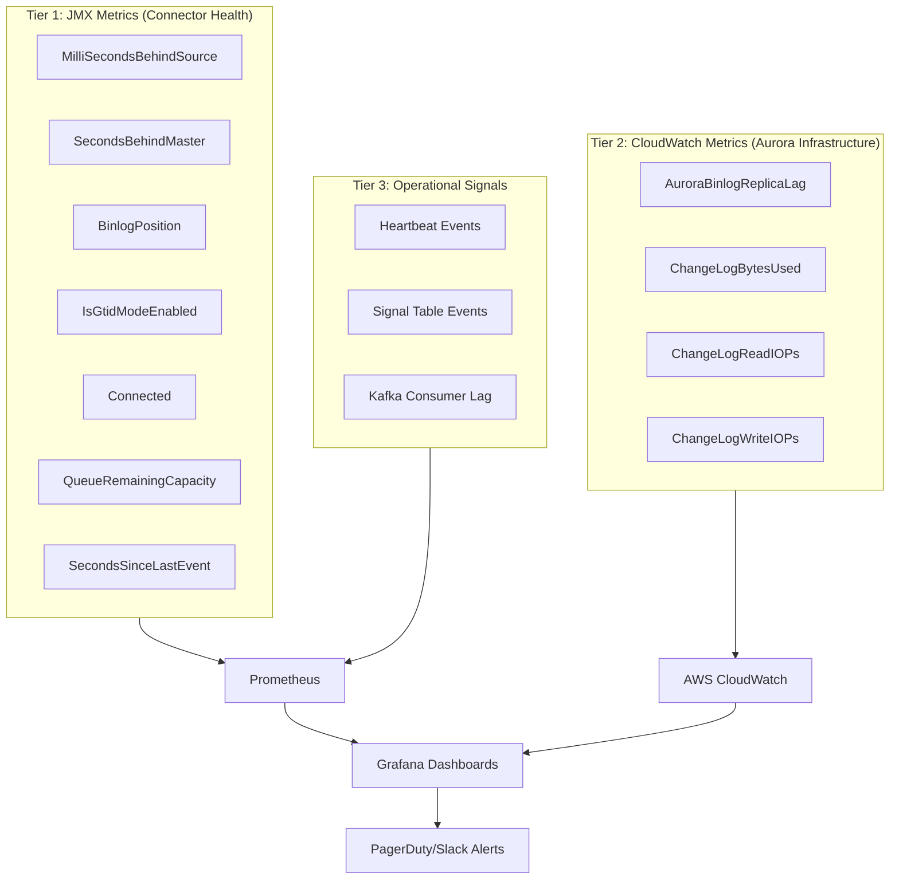

import { Mermaid } from '../../../components/Mermaid.tsx';
import Callout from '../../../components/Callout.tsx';

# Binlog Lag Monitoring: Метрики JMX и CloudWatch для Production CDC

## Почему мониторинг lag критичен?

В production CDC deployment, **lag** (задержка репликации) - это ключевая метрика здоровья системы. Lag показывает, насколько далеко Debezium отстает от текущего состояния базы данных.

**Последствия высокого lag**:

- **Data Freshness Issues**: Downstream системы получают устаревшие данные (seconds, minutes, hours behind reality)
- **Business Impact**: Real-time dashboards показывают неактуальную информацию, аналитика работает на outdated данных
- **Operational Risk**: При приближении lag к binlog retention period возникает риск position loss (урок 3)
- **Capacity Planning**: Постоянный lag указывает на bottleneck (недостаточная пропускная способность Kafka, медленный consumer)

**Примеры бизнес-сценариев**:

- **E-commerce**: Order status в mobile app отстает от реальности на 30 секунд -> customer видит "Processing" вместо "Shipped"
- **Финтех**: Transaction fraud detection работает на данных с задержкой 2 минуты -> мошеннические транзакции успевают пройти
- **IoT**: Sensor data для алертов имеет lag 5 минут -> критические события обнаруживаются с опозданием

**Цель этого урока**: Построить comprehensive monitoring system для MySQL CDC с использованием JMX metrics, CloudWatch metrics (для Aurora), Prometheus alerting, и Grafana dashboards.

## Three-Tier Monitoring Architecture

В production MySQL CDC мы используем **три уровня мониторинга**, каждый из которых предоставляет разный perspective на health системы.

<Mermaid>

</Mermaid>

**Tier 1: JMX Metrics** - Connector-level health (что Debezium видит и делает)
**Tier 2: CloudWatch Metrics** - Infrastructure-level health (что происходит на Aurora database layer)
**Tier 3: Operational Signals** - Application-level health (как события проходят через pipeline)

**Почему три уровня?**

Представьте ситуацию:

- **Tier 1 (JMX)**: `MilliSecondsBehindSource = 100ms` (connector считает, что всё хорошо)
- **Tier 2 (CloudWatch)**: `AuroraBinlogReplicaLag = 300s` (Aurora cross-region replica отстает на 5 минут)
- **Tier 3 (Operational)**: Heartbeat events приходят раз в 10 секунд (всё работает)

**Вывод**: Connector работает корректно и читает binlog быстро (Tier 1 OK), но infrastructure-level проблема (Aurora replication lag) может привести к проблемам при failover. Без Tier 2 мониторинга мы бы это не заметили.

**Single-layer monitoring - распространенная ошибка**. Вы настраиваете только JMX metrics и пропускаете infrastructure-level issues, которые проявятся только при failover или disaster recovery.

## JMX Metrics Deep Dive

Debezium MySQL connector expose десятки JMX metrics через HTTP endpoint (обычно port 9404). Мы сфокусируемся на ключевых метриках для lag monitoring.

### MilliSecondsBehindSource vs SecondsBehindMaster

Это **две разные метрики** для измерения lag, и важно понимать разницу.

**MilliSecondsBehindSource** (Debezium-calculated):

```
debezium_metrics_MilliSecondsBehindSource{context="streaming", server="mysql-server"}
```

**Как рассчитывается**:

1. Debezium читает timestamp из binlog event (`source.ts_ms`)
2. Сравнивает с текущим system time
3. Разница = lag

**Пример**:

```json
{
  "source": {
    "ts_ms": 1672531200000,  // Event timestamp (2023-01-01 00:00:00)
    "file": "mysql-bin.000007",
    "pos": 1234
  }
}
```

Current time: `1672531205000` (2023-01-01 00:00:05)

**MilliSecondsBehindSource** = `1672531205000 - 1672531200000 = 5000ms` (5 секунд lag)

**SecondsBehindMaster** (MySQL-calculated):

```
debezium_metrics_SecondsBehindMaster{context="streaming", server="mysql-server"}
```

**Как рассчитывается**:

MySQL рассчитывает эту метрику на основе `SHOW SLAVE STATUS` (для replica) или internal tracking (для CDC tools).

Формула (упрощенно):

```
SecondsBehindMaster = current_time - last_binlog_event_timestamp_processed_by_replica
```

<Callout type="tip">

**Какую метрику использовать?**

**Рекомендация**: Используйте `MilliSecondsBehindSource` как primary lag metric.

**Причины**:

- **Точность**: Миллисекунды vs секунды (более granular для low-latency requirements)
- **Consistency**: Debezium рассчитывает на основе real event timestamps (более надежно)
- **Availability**: `SecondsBehindMaster` может быть unavailable в некоторых конфигурациях

**Когда использовать SecondsBehindMaster**:

- Для сравнения с MySQL replica lag (если у вас есть read replicas)
- Для cross-checking с `MilliSecondsBehindSource` (если метрики расходятся значительно - investigate)

</Callout>

<Callout type="warning">

**SecondsBehindMaster = -1 во время failover - это нормально**

При failover Aurora или manual switch master/slave, вы можете видеть:

```
SecondsBehindMaster = -1
```

**Это НЕ ошибка**. `-1` означает:

- MySQL не может рассчитать lag (нет активной master connection)
- Temporary state во время переключения
- Обычно исчезает через 5-30 секунд после failover completion

**Не создавайте alert на `SecondsBehindMaster == -1`**. Вместо этого используйте:

```promql
# Alert only if -1 persists more than 2 minutes
SecondsBehindMaster == -1 AND time() - last_transition_time > 120
```

</Callout>

### BinlogPosition и BinlogFilename

Эти метрики показывают **текущую позицию** Debezium в binlog.

```
debezium_metrics_BinlogPosition{context="streaming", server="mysql-server"}
debezium_metrics_BinlogFilename{context="streaming", server="mysql-server"}
```

**Пример значений**:

```
BinlogFilename = "mysql-bin.000007"
BinlogPosition = 154892
```

**Use cases**:

1. **Position Tracking**: Понимание, где находится Debezium (особенно полезно для debugging)
2. **Retention Risk Detection**: Сравнение с oldest available binlog file (для предотвращения position loss)
3. **Failover Coordination**: При failover Aurora, вы можете проверить, успел ли Debezium прочитать все события из старого master

**Пример Grafana panel** (text panel showing current position):

```promql
label_replace(
  debezium_metrics_BinlogFilename,
  "position",
  "$1",
  "BinlogFilename",
  ".*"
)
```

Отображает: `mysql-bin.000007:154892`

### IsGtidModeEnabled

```
debezium_metrics_IsGtidModeEnabled{context="streaming", server="mysql-server"}
```

**Значения**:

- `1` = GTID mode enabled (recommended для Aurora failover)
- `0` = GTID mode disabled (file:position tracking - risky для failover)

**Why monitor this?**

GTID mode - это критическое требование для production Aurora CDC (урок 2). Если кто-то случайно disabled GTID mode в MySQL конфигурации, вы должны узнать об этом **немедленно**, потому что:

- При следующем failover Debezium может потерять позицию
- Resnapshot может потребоваться

**Alert rule**:

```yaml
- alert: DebeziumGtidModeDisabled
  expr: debezium_metrics_IsGtidModeEnabled == 0
  for: 5m
  labels:
    severity: critical
  annotations:
    summary: "GTID mode disabled on MySQL connector"
    description: "Connector {{ $labels.server }} is running without GTID mode. Failover resilience is compromised."
```

### Connected

```
debezium_metrics_Connected{context="streaming", server="mysql-server"}
```

**Значения**:

- `1` = Connector connected to database
- `0` = Connector disconnected (network issue, database down, credentials invalid)

**Critical metric** для operational health. Если `Connected == 0`, connector не читает binlog -> lag растет -> risk of position loss.

**Типичные причины disconnection**:

1. **Database Restart**: Planned maintenance (temporary disconnect)
2. **Network Issues**: VPC routing problems, security group misconfiguration
3. **Credentials Rotation**: Password changed, connector не обновлен
4. **Aurora Failover**: Temporary disconnect во время failover (обычно менее 30 секунд)

**Alert rule**:

```yaml
- alert: DebeziumConnectorDisconnected
  expr: debezium_metrics_Connected == 0
  for: 2m
  labels:
    severity: critical
  annotations:
    summary: "Debezium connector disconnected"
    description: "Connector {{ $labels.server }} lost database connection for >2 minutes."
```

**Grace period 2 minutes**: Aurora failover обычно занимает 30-90 секунд. 2-minute threshold избегает false positives во время planned failovers.

### QueueRemainingCapacity

```
debezium_metrics_QueueRemainingCapacity{context="streaming", server="mysql-server"}
debezium_metrics_QueueTotalCapacity{context="streaming", server="mysql-server"}
```

**What is the queue?**

Debezium использует **internal queue** для буферизации событий между binlog reader thread и Kafka producer thread.

<Mermaid>

</Mermaid>

**Queue capacity** (default: 8192 events)

**QueueRemainingCapacity** показывает, сколько места осталось в queue.

**Пример расчета queue utilization**:

```promql
100 * (1 - (debezium_metrics_QueueRemainingCapacity / debezium_metrics_QueueTotalCapacity))
```

**Интерпретация**:

- **0-50%**: Healthy (queue mostly empty, no backpressure)
- **50-75%**: Warning (Kafka write slower than binlog read - investigate Kafka performance)
- **75-90%**: Critical (high backpressure - Kafka bottleneck)
- **>90%**: Danger (queue almost full - events будут dropped or connector will block)

**Why high queue utilization is bad?**

1. **Latency Increase**: События застревают в queue дольше (increased lag)
2. **Memory Pressure**: Queue хранится в JVM heap (risk of OutOfMemoryError)
3. **Kafka Bottleneck**: Connector читает binlog быстрее, чем может писать в Kafka

**Common causes of high queue utilization**:

- Kafka broker performance issues (slow disk, network saturation)
- Kafka topic misconfiguration (too few partitions, low replication factor causing write delays)
- Kafka Connect worker memory constraints (insufficient JVM heap)

**Alert rule**:

```yaml
- alert: DebeziumQueueHighUtilization
  expr: 100 * (1 - (debezium_metrics_QueueRemainingCapacity / debezium_metrics_QueueTotalCapacity)) > 80
  for: 5m
  labels:
    severity: warning
  annotations:
    summary: "Debezium internal queue high utilization"
    description: "Connector {{ $labels.server }} queue utilization {{ $value }}%. Check Kafka write performance."
```

### SecondsSinceLastEvent

```
debezium_metrics_MilliSecondsSinceLastEvent{context="streaming", server="mysql-server"}
```

(Note: Metric name говорит "MilliSeconds", но обычно используется в секундах для удобства: `MilliSecondsSinceLastEvent / 1000`)

**What it measures**:

Сколько времени прошло с момента последнего события, **прочитанного Debezium** из binlog.

**Use cases**:

1. **Idle Table Detection**: Если таблицы не меняются долго, `SecondsSinceLastEvent` будет high (это OK, если действительно нет изменений)
2. **Streaming Stall Detection**: Если таблицы **должны** меняться активно, но `SecondsSinceLastEvent` high -> connector застрял (investigate)
3. **Heartbeat Verification**: С heartbeat events (урок 3), эта метрика **никогда не должна превышать heartbeat interval** (например, 10 секунд)

**Пример scenario**:

- Heartbeat interval = 10 секунд
- `SecondsSinceLastEvent = 120` (2 минуты)

**Вывод**: Heartbeat events **не приходят** -> connector не читает binlog -> critical issue.

**Возможные причины**:

- Connector disconnected (`Connected == 0`)
- Heartbeat table permissions отозваны (Debezium не может писать в heartbeat table)
- Binlog position invalid (connector пытается прочитать несуществующий file:position)

<Callout type="warning">

**Heartbeat interval must be less than `60s` для reliable idle detection**

Если вы используете `heartbeat.interval.ms = 60000` (1 минута) или выше:

- `SecondsSinceLastEvent` может быть >60 seconds даже при healthy connector
- Alert на `SecondsSinceLastEvent > 60` будет давать false positives

**Рекомендация**: `heartbeat.interval.ms = 10000` (10 секунд), alert threshold = 60 секунд (6x heartbeat interval для tolerance).

</Callout>

**Alert rule**:

```yaml
- alert: DebeziumNoRecentEvents
  expr: debezium_metrics_MilliSecondsSinceLastEvent / 1000 > 60
  for: 2m
  labels:
    severity: warning
  annotations:
    summary: "Debezium has not received events recently"
    description: "Connector {{ $labels.server }} last event >60 seconds ago. Check heartbeat and binlog reading."
```

## Aurora CloudWatch Metrics

Если вы используете **Aurora MySQL** (Phase 14), у вас есть дополнительный layer мониторинга через **AWS CloudWatch**.

### AuroraBinlogReplicaLag

```
AWS/RDS -> AuroraBinlogReplicaLag (metric for Aurora cluster)
```

**What it measures**:

Lag между **Aurora master** и **Aurora read replica** в cross-region replication scenario.

**Unit**: Seconds

**Why это важно для Debezium?**

Представьте setup:

- **Primary Region (us-east-1)**: Aurora MySQL cluster (master)
- **Secondary Region (eu-west-1)**: Aurora MySQL replica cluster (for disaster recovery)
- **Debezium**: Читает из primary region master

**Scenario**:

1. Primary region работает нормально, Debezium читает binlog с lag менее 1 секунды
2. `AuroraBinlogReplicaLag` в secondary region = 300 seconds (5 минут) из-за network latency
3. Primary region **failover** -> secondary region becomes new master
4. Debezium reconnect к new master (secondary region)
5. Debezium **пытается читать binlog**, но последние 5 минут событий **еще не replicated**
6. Потенциальная **data loss** или необходимость resnapshot

**Monitoring этой метрики позволяет**:

- Убедиться, что cross-region replica **достаточно close** к master для safe failover
- Detect network issues между regions **до** failover происходит
- Plan failover timing (если lag high, отложить failover до convergence)

<Callout type="tip">

**Когда использовать CloudWatch vs JMX?**

**JMX metrics (MilliSecondsBehindSource)**: Connector-level lag (что Debezium отстает от database)

**CloudWatch metrics (AuroraBinlogReplicaLag)**: Infrastructure-level lag (что replica отстает от master)

**Используйте обе**:

- JMX для operational health (connector работает корректно)
- CloudWatch для infrastructure health (replicas готовы к failover)

**Пример**: JMX показывает 100ms lag (отлично), CloudWatch показывает 600s lag (проблема). Вывод: Connector работает отлично, но infrastructure не готов к failover.

</Callout>

### Enhanced Binlog Metrics (Lesson 8 Reference)

Если вы используете **Aurora Enhanced Binlog** (урок 8), мониторьте эти CloudWatch metrics:

**ChangeLogBytesUsed** (Bytes):

- Сколько места занимают binlog данные в Aurora change log
- Alert: Если приближается к max capacity (зависит от instance class)
- Означает: Binlog накапливается быстрее, чем purge происходит

**ChangeLogReadIOPs** (Count/Second):

- Частота чтения из change log (Debezium + replicas)
- High values = active CDC reading (normal)
- Sudden drop = connector stopped reading (investigate)

**ChangeLogWriteIOPs** (Count/Second):

- Частота записи в change log (database transactions)
- High values = heavy write load (may need capacity scaling)
- Correlate with `MilliSecondsBehindSource`: если write IOPs spike и lag spike -> connector struggling to keep up

**Prometheus CloudWatch Exporter**:

Для интеграции CloudWatch metrics в Prometheus/Grafana, используйте [CloudWatch Exporter](https://github.com/prometheus/cloudwatch_exporter):

```yaml
# cloudwatch_exporter.yml
region: us-east-1
metrics:
  - aws_namespace: AWS/RDS
    aws_metric_name: AuroraBinlogReplicaLag
    aws_dimensions:
      - DBClusterIdentifier
    aws_statistics:
      - Average
      - Maximum
```

После этого metrics доступны как:

```promql
aws_rds_aurora_binlog_replica_lag_average{dbcluster_identifier="my-aurora-cluster"}
```

## Prometheus Alert Rules

Теперь объединим JMX и CloudWatch metrics в **comprehensive alerting strategy**.

### Alert Rule Structure

Создайте файл `alerts/debezium-mysql.yml`:

```yaml
groups:
  - name: debezium_mysql_cdc
    interval: 30s
    rules:
      # --- High Lag Alerts ---

      - alert: DebeziumHighBinlogLag
        expr: debezium_metrics_MilliSecondsBehindSource{context="streaming"} / 1000 > 60
        for: 5m
        labels:
          severity: warning
          component: debezium
          database: mysql
        annotations:
          summary: "Debezium MySQL lag exceeds 60 seconds"
          description: |
            Connector {{ $labels.server }} is {{ $value }}s behind source database.

            Current lag: {{ $value | humanizeDuration }}
            Threshold: 60s

            Possible causes:
            - High write throughput on source database
            - Kafka write bottleneck
            - Connector queue full (check QueueRemainingCapacity)

            Impact:
            - Downstream consumers receiving stale data
            - Risk of position loss if lag approaches retention period

            Action:
            - Check Kafka cluster performance
            - Review connector queue metrics
            - Consider scaling Kafka Connect workers

      - alert: DebeziumCriticalBinlogLag
        expr: debezium_metrics_MilliSecondsBehindSource{context="streaming"} / 1000 > 300
        for: 5m
        labels:
          severity: critical
          component: debezium
          database: mysql
        annotations:
          summary: "Debezium MySQL lag CRITICAL (>5 minutes)"
          description: |
            Connector {{ $labels.server }} is {{ $value }}s behind source.

            This is approaching dangerous territory if binlog retention is 7 days.

            IMMEDIATE ACTION REQUIRED:
            1. Check connector status (Connected metric)
            2. Investigate Kafka write throughput
            3. Review database load and binlog generation rate
            4. Consider temporary table.include.list reduction to catch up

      # --- Connection Health ---

      - alert: DebeziumConnectorDisconnected
        expr: debezium_metrics_Connected{context="streaming"} == 0
        for: 2m
        labels:
          severity: critical
          component: debezium
        annotations:
          summary: "Debezium connector disconnected from database"
          description: |
            Connector {{ $labels.server }} has been disconnected for >2 minutes.

            Lag will continue growing while disconnected.

            Check:
            - Database availability (Aurora endpoint reachable?)
            - Network connectivity (VPC routing, security groups)
            - Credentials validity (password rotation?)
            - Connector logs for connection errors

      # --- Idle Detection ---

      - alert: DebeziumNoRecentEvents
        expr: debezium_metrics_MilliSecondsSinceLastEvent{context="streaming"} / 1000 > 60
        for: 2m
        labels:
          severity: warning
          component: debezium
        annotations:
          summary: "Debezium has not received events for >60 seconds"
          description: |
            Connector {{ $labels.server }} last event was {{ $value }}s ago.

            If heartbeat is configured (interval 10s), this indicates:
            - Heartbeat table writes failing
            - Binlog reading stalled
            - Connector in error state (but not yet disconnected)

            Check:
            - Heartbeat table permissions
            - Connector task status (FAILED vs RUNNING)
            - Binlog position validity

      # --- Queue Backpressure ---

      - alert: DebeziumQueueHighUtilization
        expr: 100 * (1 - (debezium_metrics_QueueRemainingCapacity{context="streaming"} / debezium_metrics_QueueTotalCapacity{context="streaming"})) > 80
        for: 5m
        labels:
          severity: warning
          component: debezium
        annotations:
          summary: "Debezium internal queue high utilization"
          description: |
            Connector {{ $labels.server }} queue is {{ $value }}% full.

            This indicates Kafka writes are slower than binlog reads (backpressure).

            Check:
            - Kafka broker performance (disk I/O, network)
            - Kafka topic partition count (increase parallelism?)
            - Kafka Connect worker memory (increase max.heap.size?)

      # --- GTID Mode Safety ---

      - alert: DebeziumGtidModeDisabled
        expr: debezium_metrics_IsGtidModeEnabled{context="streaming"} == 0
        for: 5m
        labels:
          severity: critical
          component: debezium
        annotations:
          summary: "GTID mode disabled - failover resilience compromised"
          description: |
            Connector {{ $labels.server }} is running without GTID mode.

            CRITICAL ISSUE:
            - Aurora failover may cause position loss
            - File:position tracking unreliable during failover
            - Resnapshot likely required after failover

            Action:
            1. Enable GTID mode on MySQL (gtid_mode=ON, enforce_gtid_consistency=ON)
            2. Restart connector to detect GTID mode
            3. Verify metric changes to 1

      # --- Aurora-Specific Alerts ---

      - alert: AuroraBinlogLagHigh
        expr: aws_rds_aurora_binlog_replica_lag_average > 300
        for: 5m
        labels:
          severity: warning
          component: aurora
          database: mysql
        annotations:
          summary: "Aurora cross-region binlog replication lag >5 minutes"
          description: |
            Aurora cluster {{ $labels.dbcluster_identifier }} replica lag: {{ $value }}s

            Impact:
            - Failover to replica may result in data loss (last {{ $value }}s of events not replicated)
            - Debezium reconnect after failover may encounter missing binlog events

            Check:
            - Network latency between regions
            - Replica instance size (sufficient for replication load?)
            - Write throughput on primary (exceeding replica capacity?)

      - alert: AuroraBinlogLagCritical
        expr: aws_rds_aurora_binlog_replica_lag_average > 600
        for: 10m
        labels:
          severity: critical
          component: aurora
        annotations:
          summary: "Aurora cross-region lag CRITICAL (>10 minutes)"
          description: |
            Replica lag {{ $value }}s is extremely high.

            DO NOT FAILOVER until lag reduces.

            Immediate investigation required:
            - Check replication thread status on replica
            - Review network connectivity between regions
            - Consider increasing replica instance class
```

**Alert Routing** (example for Alertmanager):

```yaml
# alertmanager.yml
route:
  group_by: ['alertname', 'component']
  group_wait: 10s
  group_interval: 10s
  repeat_interval: 12h
  receiver: 'slack-debezium'
  routes:
    - match:
        severity: critical
      receiver: 'pagerduty-oncall'
      continue: true

    - match:
        component: aurora
      receiver: 'slack-infrastructure'

receivers:
  - name: 'slack-debezium'
    slack_configs:
      - api_url: 'https://hooks.slack.com/services/YOUR/WEBHOOK'
        channel: '#debezium-alerts'
        title: '{{ .GroupLabels.alertname }}'
        text: '{{ range .Alerts }}{{ .Annotations.description }}{{ end }}'

  - name: 'pagerduty-oncall'
    pagerduty_configs:
      - service_key: 'YOUR_PAGERDUTY_KEY'
```

## Grafana Dashboard Configuration

Визуализация metrics в Grafana позволяет быстро обнаружить проблемы и trends.

### MySQL-Specific Dashboard Structure

Мы создадим dedicated MySQL dashboard (в дополнение к generic Debezium production dashboard):

**Dashboard: "Debezium MySQL Connector"**

**Row 1: Connection Health**

1. **Connected Status** (Gauge panel)
   - Metric: `debezium_metrics_Connected{context="streaming"}`
   - Thresholds: 0=Red (Disconnected), 1=Green (Connected)
   - Display: Value mapping (0->Disconnected, 1->Connected)

2. **GTID Mode Enabled** (Gauge panel)
   - Metric: `debezium_metrics_IsGtidModeEnabled{context="streaming"}`
   - Thresholds: 0=Red (Disabled), 1=Green (Enabled)
   - Critical safety indicator

3. **Seconds Since Last Event** (Stat panel)
   - Metric: `debezium_metrics_MilliSecondsSinceLastEvent{context="streaming"} / 1000`
   - Thresholds: less than `10s`=Green, `10-60s`=Yellow, more than `60s`=Red
   - Heartbeat health indicator

**Row 2: Lag Metrics**

1. **MilliSecondsBehindSource** (Time series graph)
   - Metric: `debezium_metrics_MilliSecondsBehindSource{context="streaming"} / 1000`
   - Unit: Seconds
   - Threshold lines: 5s (warning), 30s (critical)
   - Legend: Show mean, max, current

2. **SecondsBehindMaster** (Time series graph)
   - Metric: `debezium_metrics_SecondsBehindMaster{context="streaming"}`
   - Filter: `!= -1` (exclude failover states)
   - Compare with MilliSecondsBehindSource

3. **Queue Remaining Capacity** (Gauge panel)
   - Metric: `100 * (1 - (debezium_metrics_QueueRemainingCapacity / debezium_metrics_QueueTotalCapacity))`
   - Unit: Percent
   - Thresholds: less than 50%=Green, 50-80%=Yellow, more than 80%=Red

**Row 3: Position Tracking**

1. **Binlog Position** (Stat panel)
   - Metric: `debezium_metrics_BinlogPosition{context="streaming"}`
   - Format: Number (no decimals)
   - Shows current position in file

2. **Binlog Filename** (Text panel)
   - Metric: `debezium_metrics_BinlogFilename{context="streaming"}`
   - Display: Current filename (mysql-bin.NNNNNN)

3. **Events Processed** (Stat panel with graph)
   - Metric: `rate(debezium_metrics_TotalNumberOfEventsSeen{context="streaming"}[1m])`
   - Unit: Events/sec
   - Shows throughput

**Row 4: Snapshot Status**

1. **Snapshot Running** (Gauge)
   - Metric: `debezium_metrics_SnapshotRunning{context="snapshot"}`
   - 0=Not running, 1=Running

2. **Snapshot Completed** (Gauge)
   - Metric: `debezium_metrics_SnapshotCompleted{context="snapshot"}`
   - 0=Not completed, 1=Completed

3. **Snapshot Progress** (Stat)
   - Metric: `debezium_metrics_RowsScanned{context="snapshot"}`
   - Shows rows scanned (only during snapshot)

### PromQL Query Examples

**Lag with 5-minute moving average** (smooths spikes):

```promql
avg_over_time(debezium_metrics_MilliSecondsBehindSource{context="streaming"}[5m]) / 1000
```

**Queue utilization percentage**:

```promql
100 * (1 - (
  debezium_metrics_QueueRemainingCapacity{context="streaming"}
  /
  debezium_metrics_QueueTotalCapacity{context="streaming"}
))
```

**Events per second (1-minute rate)**:

```promql
rate(debezium_metrics_TotalNumberOfEventsSeen{context="streaming"}[1m])
```

**Binlog file + position (combined)**:

```promql
label_join(
  debezium_metrics_BinlogPosition,
  "position",
  ":",
  "BinlogFilename",
  "BinlogPosition"
)
```

**SecondsBehindMaster excluding -1 (failover states)**:

```promql
debezium_metrics_SecondsBehindMaster{context="streaming"} != -1
```

### Official Debezium MySQL Dashboard

Grafana community поддерживает official Debezium MySQL dashboard:

**Dashboard ID: 11523** ([link](https://grafana.com/grafana/dashboards/11523))

**Как импортировать**:

1. Grafana UI -> Dashboards -> Import
2. Введите ID: `11523`
3. Select Prometheus datasource
4. Import

**Что включено**:

- Connection status
- Lag metrics (MilliSecondsBehindSource, SecondsBehindMaster)
- Throughput (events/sec, transactions/sec)
- Queue metrics
- Snapshot progress

**Рекомендация**: Используйте official dashboard как **starting point**, затем customize для ваших specific requirements (добавить CloudWatch metrics, custom alerts visualization).

## Common Monitoring Pitfalls

### Pitfall 1: Ignoring Infrastructure Metrics

**Проблема**: Мониторинг только JMX metrics (connector health), игнорирование CloudWatch metrics (infrastructure health).

**Сценарий**:

- JMX: `MilliSecondsBehindSource = 50ms` (отлично)
- CloudWatch: `AuroraBinlogReplicaLag = 900s` (15 минут)
- Aurora failover происходит
- Debezium reconnect к replica
- **Last 15 minutes of events missing** in replica binlog
- Position loss -> resnapshot required

**Решение**: Monitor **both** JMX and CloudWatch metrics. Set alerts on `AuroraBinlogReplicaLag > 300s`.

### Pitfall 2: Single Threshold Alerting

**Проблема**: Alert только на одном threshold (например, `lag > 60s`), без учета trend и duration.

**Сценарий**:

- Lag spike до 65s на 10 секунд (temporary burst в database writes)
- Alert fires -> oncall engineer woken up
- Lag returns to 5s
- **False positive** (unnecessary alert)

**Решение**: Используйте `for: 5m` в Prometheus alerts (lag должен быть >60s **в течение 5 минут** для firing alert).

### Pitfall 3: Heartbeat Interval Too High

**Проблема**: `heartbeat.interval.ms = 300000` (5 минут), alert на `SecondsSinceLastEvent > 60`.

**Сценарий**:

- Idle tables, no real events
- Last heartbeat was 4 minutes ago
- Alert fires: "No events for >60 seconds"
- **False positive** (heartbeat interval is 5 minutes, next heartbeat in 1 minute)

**Решение**:

- Heartbeat interval должен быть **значительно меньше** alert threshold
- Recommended: `heartbeat.interval.ms = 10000` (10s), alert threshold = 60s

### Pitfall 4: No Lag Trend Analysis

**Проблема**: Alert только на **current lag value**, без учета trend (растет или падает lag).

**Сценарий**:

- Current lag: 45s (below 60s threshold, no alert)
- Lag **растет** со скоростью 10s/minute
- Через 2 minutes lag будет 65s (alert fires)
- **Late detection** (должны были заметить trend раньше)

**Решение**: Используйте **derivative** queries для trend detection:

```promql
# Lag growth rate (seconds per minute)
deriv(debezium_metrics_MilliSecondsBehindSource[5m]) * 60 / 1000
```

Alert на `lag_growth_rate > 5` (если lag растет >5s/minute, investigate).

## Hands-on Exercises

### Exercise 1: Configure Prometheus Alert for 30-Second Lag

**Goal**: Создать custom alert rule для вашего environment с threshold 30 seconds (более strict, чем 60s).

**Steps**:

1. Создайте файл `labs/monitoring/prometheus/alerts/custom-mysql.yml`:

```yaml
groups:
  - name: custom_mysql_lag
    interval: 30s
    rules:
      - alert: CustomMySQLLagHigh
        expr: debezium_metrics_MilliSecondsBehindSource{context="streaming", server="mysql-server"} / 1000 > 30
        for: 3m
        labels:
          severity: warning
          team: data-engineering
        annotations:
          summary: "Custom MySQL lag alert (30s threshold)"
          description: "Lag: {{ $value }}s on {{ $labels.server }}"
```

2. Update Prometheus config (`prometheus.yml`) для загрузки alert rules:

```yaml
rule_files:
  - "alerts/*.yml"
```

3. Reload Prometheus config:

```bash
curl -X POST http://localhost:9090/-/reload
```

4. Проверить в Prometheus UI -> Alerts -> `CustomMySQLLagHigh` appears

**Verification**:

- Создать artificial lag (stop Kafka Connect)
- Watch alert transition: inactive -> pending (3m) -> firing
- Resume Kafka Connect
- Watch alert resolve

### Exercise 2: Query JMX Metrics via curl

**Goal**: Прямой query JMX metrics через HTTP endpoint (полезно для debugging без Prometheus).

**Prerequisites**: Kafka Connect должен export metrics на port 9404 (configured в docker-compose.yml).

**Steps**:

1. Curl metrics endpoint:

```bash
curl -s http://localhost:9404/metrics | grep debezium_metrics
```

**Output** (sample):

```
debezium_metrics_Connected{context="streaming",server="mysql-server"} 1.0
debezium_metrics_MilliSecondsBehindSource{context="streaming",server="mysql-server"} 234.0
debezium_metrics_SecondsBehindMaster{context="streaming",server="mysql-server"} 0.0
debezium_metrics_BinlogPosition{context="streaming",server="mysql-server"} 154892.0
debezium_metrics_IsGtidModeEnabled{context="streaming",server="mysql-server"} 1.0
debezium_metrics_QueueRemainingCapacity{context="streaming",server="mysql-server"} 8102.0
debezium_metrics_QueueTotalCapacity{context="streaming",server="mysql-server"} 8192.0
```

2. Filter для specific metric:

```bash
curl -s http://localhost:9404/metrics | grep MilliSecondsBehindSource
```

3. Parse с jq (если metrics в JSON format - зависит от exporter):

```bash
# Для Prometheus format используйте awk
curl -s http://localhost:9404/metrics | grep MilliSecondsBehindSource | awk '{print $2}'
```

**Output**: `234.0` (lag в миллисекундах)

**Practical use**: Quick check connector health без Grafana access (например, SSH на Kafka Connect host).

### Exercise 3: Create CloudWatch Alarm for AuroraBinlogReplicaLag

**Goal**: Настроить AWS CloudWatch alarm для Aurora cross-region replication lag.

**Prerequisites**: Aurora MySQL cluster с cross-region replica.

**Steps (AWS Console)**:

1. **Navigate**: CloudWatch -> Alarms -> Create Alarm

2. **Select Metric**:
   - Namespace: `AWS/RDS`
   - Metric name: `AuroraBinlogReplicaLag`
   - Dimension: `DBClusterIdentifier = your-cluster-name`
   - Statistic: `Average`
   - Period: `1 minute`

3. **Define Threshold**:
   - Condition: `Greater than`
   - Threshold value: `300` (5 minutes)

4. **Configure Actions**:
   - Alarm state trigger: `In alarm`
   - SNS topic: Select or create (для email/Slack notifications)

5. **Name Alarm**:
   - Name: `aurora-binlog-lag-high`
   - Description: `Aurora cross-region binlog replication lag >5 minutes`

6. **Create Alarm**

**Verification**:

- Wait for alarm to enter `OK` state (lag less than 300s)
- Simulate lag: Pause replica cluster (if test environment) or wait for natural lag spike
- Verify alarm triggers and SNS notification received

**Alternative (AWS CLI)**:

```bash
aws cloudwatch put-metric-alarm \
  --alarm-name aurora-binlog-lag-high \
  --alarm-description "Aurora binlog replication lag >5 minutes" \
  --metric-name AuroraBinlogReplicaLag \
  --namespace AWS/RDS \
  --statistic Average \
  --period 60 \
  --threshold 300 \
  --comparison-operator GreaterThanThreshold \
  --evaluation-periods 5 \
  --dimensions Name=DBClusterIdentifier,Value=your-cluster-name \
  --alarm-actions arn:aws:sns:us-east-1:123456789012:debezium-alerts
```

## Key Takeaways

- **Three-tier monitoring** (JMX + CloudWatch + Operational) provides comprehensive CDC health visibility
- **MilliSecondsBehindSource** (JMX) - preferred lag metric (more precise than SecondsBehindMaster)
- **SecondsBehindMaster = -1** during failover is normal, not an error (don't alert on this)
- **BinlogPosition** and **BinlogFilename** track current Debezium position in binlog
- **IsGtidModeEnabled** must be `1` for production Aurora failover resilience
- **Connected** metric critical for detecting database disconnections (alert threshold: 2 minutes for failover grace period)
- **QueueRemainingCapacity** detects Kafka write bottlenecks (>80% utilization = backpressure)
- **SecondsSinceLastEvent** with heartbeat detects streaming stalls (threshold: 60s with 10s heartbeat interval)
- **AuroraBinlogReplicaLag** (CloudWatch) monitors cross-region replication health (critical for failover readiness)
- **Enhanced Binlog metrics** (ChangeLogBytesUsed, ChangeLogReadIOPs) for Aurora-specific monitoring
- **Prometheus alerts** should use `for: 5m` duration to avoid false positives from temporary spikes
- **Grafana dashboard ID 11523** - official Debezium MySQL dashboard (good starting point)
- **Common pitfalls**: Single-layer monitoring, heartbeat interval too high, no lag trend analysis
- **Hands-on verification**: curl JMX endpoint, configure custom alerts, CloudWatch alarms for Aurora

## Что дальше?

Мы завершили Module 8 (MySQL/Aurora MySQL Specifics):

- **Lesson 1**: Binlog architecture
- **Lesson 2**: GTID mode fundamentals
- **Lesson 3**: Binlog retention и heartbeat
- **Lesson 4**: MySQL connector configuration
- **Lesson 5**: Binlog vs WAL comparison (PostgreSQL knowledge transfer)
- **Lesson 6**: Schema history recovery
- **Lesson 7**: Aurora parameter groups
- **Lesson 8**: Enhanced Binlog architecture
- **Lesson 9**: Aurora snapshot modes
- **Lesson 10**: Binlog lag monitoring (this lesson)

**Next Phase (Production Operations)**:

- **Alerting Strategies**: Escalation policies, on-call runbooks, incident response
- **Performance Tuning**: Connector parallelism, Kafka partition sizing, batch sizes
- **Disaster Recovery**: Backup/restore procedures, cross-region failover, resnapshot optimization
- **Security Hardening**: TLS encryption, credential rotation, IAM authentication

Вы теперь можете **мониторить production MySQL CDC pipeline** с full visibility на connector health, infrastructure health, и operational signals. В следующей фазе мы применим эти знания для building resilient, performant, secure CDC systems.
